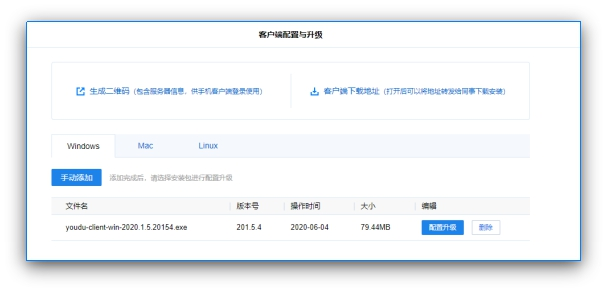
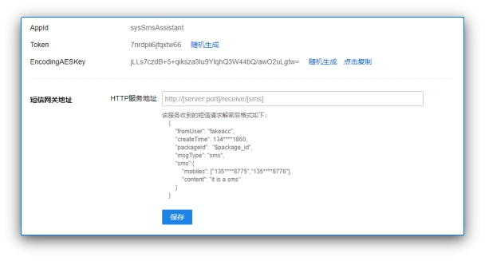

# **有度管理后台使用手册**

## **1.** **前言**

本文档主要是作为有度管理后台使用指引手册。

## **2.** **通讯录**

### **2.1.** **创建部门和帐号**

有度即时通支持在管理后台的通讯录中，采用手工的方式进行部门和帐号的管理操作：

1) 在通讯录的部门目录树中，点部门右侧的菜单 按钮，进行添加子部门、修改和顺序的调整。

2) 选中部门后，可以在右侧的人员列表上方，点击“新增成员”来添加帐号；

3) 如需移动部门成员到新的部门节点，可以勾选帐号，然后点击上方的“新增成员”，在下拉菜单中选择“迁移成员”，然后选择新的部门节点即可；

注意，如果对部门成员在组织架构中的显示顺序有要求，比如：部门领导的显示顺序，可以按照以下方法设置：

1) 进入到：我的企业->通讯录管理->通讯录排序规则，选择“按照权重和帐号名”显示方式；

2) 选中部门内的成员，修改该成员的权重值，权重值越大显示顺序越靠前。

备注：除了手工创建组织架构外，我们还支持其他方式组织架构获取，如[通讯录批量导入](#_通讯录批量导入)、[组织架构同步接口](#_组织架构同步接口)、[LDAP集成](#_LDAP集成)。

### **2.2.** **授权和禁用**

#### **2.2.1.** **登录授权**

在通讯录页面中，如果需要帐号手动添加帐号授权信息，可先勾选帐号 ->【登录授权】，对已选中帐号做以下操作：

- 加入授权名单

- 取消授权

- 加入禁用名单

- 取消禁用

 

#### **2.2.2.** **授权名单和禁用名单**

授权名单：允许登录有度客户端的帐号名单。

取消授权：勾选帐号 ->【取消授权】，可取消选中帐号的占用的授权。

 

禁用名单：禁止登录有度即时通的帐号名单

取消禁用：勾选帐号 ->【取消禁用】，被选中帐号将移除禁用名单，可重新获取授权。

 

### **2.3.** **保密设置**

如果需要对特定帐号信息进行保密隐藏，可以在【通讯录】-> 勾选帐号 ->【保密设置】中，勾选需要保密的帐号信息；该类信息将不会在客户端中公开显示。

 

### **2.4.** **批量导入/导出**

#### **2.4.1.** **通讯录批量导入**

通讯录可批量导入导出，支持导入dat格式的通讯录、RTX的通讯录（RTX2005以上版本的xms格式）、excel格式的部门成员。前面两种格式，直接导入文件即可，但是excel格式导入有所不同。

excel 导入的方式需要先手工创建好组织架构的部门目录，然后通过如下步骤按照部门进行帐号导入：

 

1）在通讯录中选中需要导入帐号的部门节点；

2) 在右侧的的菜单栏中，点击“批量导入/导出”；

3) 在导入通讯录的功能模块中，点击“导入 excel 格式的部门成员”。

4) 下载 excel 导入的标准模版文件，按照模版提供的格式填入该部门下的成员帐号信息后，将该文件上传导入至响应的部门。

注意事项：不要修改 excel 模板的格式，否则会造成无法导入。

#### **2.4.2.** **通讯录批量导出**

通讯录导出，支持dat格式和excel格式；

通讯录的批量导出主要是作为组织架构备份使用，由于有度帐号是带有GID唯一标识的，通过dat格式导出的通讯录，可以保证在GID不改变的情况下，直接导入使用。

注意：execl格式导出的通讯录仅作为帐号信息确认，不支持直接导入使用。

## **3.** **群管理**

在群管理界面可对固定群进行“增、删、改”等操作；可以对群成员进行新增和删除，设定群管理员。

 

注意：每个固定群的群管理员有且只有一个，如需要更换管理员，只需给既定帐号【设为管理员】即可。

讨论组不属于固定群，暂无法在有度管理后台统一管控，默认由创建者作为管理员。

## **4.** **企业应用**

### **4.1.** **应用门户模板管理**

应用门户模板管理，是全平台应用工作台的设置页面，管理员可针对不同人员设置多套应用模板类型；

默认模板，是默认全员使用的应用工作台模板，管理员可根据需要调整应用，但是无法修改适用帐号，只能选择全员。

管理员可根据实际需要，新建应用门户模板添加应用，并指定使用人员；如果该人员适用多个模板，则该人员可使用的应用，为多个新建模板应用之和。

 

注意：默认模板使用全员，如果管理员为人员帐号新建应用模板，则该人员帐号应用门户模板以新建模板为准，将不使用默认模板。

 

### **4.2.** **移动端工作台管理**

移动端工作台，是移动端应用门户视图设置界面，可根据添加企业形象模块的图片和企业名称。

 

### **4.3.** **导出企业应用**

企业应用的导入和导出，主要是为了方便对已有应用进行备份和快速导入恢复使用。

 

### **4.4.** **应用开发指南**

应用开发指南是官方提供的二次开发指南，作为企业进行二次开发的使用指南，其中内容包含集快速入门、集成案例、服务端API和客户端API等。

（[开发指南](#10011)）

### **4.5.** **系统应用**

系统应用是有度默认自带应用，企业可根据实际需要，调整应用模板进行使用。

#### **4.5.1.** **文件传输助手**

文件传输助手，是有度提供的手机和电脑互传文字、图片和文件的应用；可以实现同帐号的手机端和电脑端之前的数据传输，无需数据线。

 

#### **4.5.2.** **企业邮箱**

配置企业邮箱，成员可在客户端中接收新邮件提醒，并发送邮件。

有度默认集成了腾讯企业邮箱，支持配置腾讯企业邮箱的新邮件提醒、单点登录、同步组织架构；如果单位内部使用的是腾讯企业邮箱，就可以根据指引【?】快速配置进行使用。

 

除了默认集成的腾讯企业邮箱之外，为了满足不同企业的邮箱使用需求，有度支持其它邮箱的接入，可根据实际需要进行二次开发，实现邮箱接入使用。

 

#### **4.5.3.** **组织架构同步接口**

##### **4.5.3.1.** **通过调用接口同步**

如果单位内部有独立的人事系统用来管理部门和人员，那么可以通过有度即时通的 SDK 接口来同步部门和帐号信息。有度即时通的服务端 SDK 接口提供了如下接口：

1) 部门的管理接口，含：获取部门列表、创建部门、更新部门等；

2) 成员的管理接口，含：创建用户、更新用户、更新用户职务信息、获取用户部门信息、获取和设置用户头像信息等接口；

SDK 的接口文档请参考：https://youdu.im/api/api.html。

 

##### **4.5.3.2.** **通过腾讯企业邮箱同步**

除了通过调用接口同步之外，有度还支持通过腾讯企业邮箱同步组织架构信息；可根据配置窗口的【?】指引进行相关信息填写，并配置组织架构同步。

 

#### **4.5.4.** **工作汇报**

工作汇报模板默认分为日报、周报和月报，管理员可以根据内部需要修改报告的模板和流程，如新建模板，针对不同部门，制定合适的工作汇报模板。

通过工作汇报，可以及时了解员工工作情况，掌握工作事务进展。

 

#### **4.5.5.** **网盘**

网盘是有度系统应用之一，网盘的文件存储在本地服务器上，员工可以根据办公需要将文件保存在不同的分区，方便内部协作共享。

管理员可授权员工分区创建权限，分区创建者可以在客户端管理分区成员和文件访问权限。

 

#### **4.5.6.** **打卡应用**

打卡功能，是作为企业常用的功能之一。支持在手机上轻松打卡，自动生成打卡记录。支持设置固定上下班、自由上下班等规则。

企业可根据根据实际打卡需要设置规则，选择打卡人员。

 

注意：为了不影响当天打卡记录，在打卡功能使用过程中，打卡时间若进行了调整，需在第二天生效。

目前有度打卡功能，暂不支持同时执行多条打卡规则，请期待后续版本。

#### **4.5.7.** **工作门户设置**

为了满足不同企业内部应用的集成需求，服务端的管理后台还提供了企业应用的管理功能，可以基于企业应用搭建供员工使用的工作门户，工作门户主要包含将内部系统的便捷访问、办公系统的集成、仅供员工使用的服务号等功能。

接下来，将分步骤介绍如何搭建工作门户：

##### **4.5.7.1.** **企业应用的创建**

搭建工作门户的第一步是创建企业应用，可通过如下方式进行企业应用的创建：管理后台->企业应用->添加应用，添加应用的第一步需要设置如下信息：

| 应用名称 | 应用在工作门户里面显示的名称，比如：人事系统，办公系统等。建议 4个字为宜，最长不要超过 6 个字，太长的名字显示会显示不完整。 |
| -------- | ------------------------------------------------------------ |
| 应用Logo | 应用在工作门户里面的图标显示，可以直接选择有度即时通自带的图标，也可以直接上传自定义的图标。 |
| 应用介绍 | 应用的简单说明，最少四个字，最长不超过 120 字。              |
| 显示终端 | 可以根据实际需要选择该应用的可见范围，默认是全平台客户端可见，如果系统本身不支持手机访问，可以将移动端客户端的勾选框去掉，这样该应用将仅仅在电脑桌面客户端显示，手机不可见。 |

创建完成后，有如下的设置项： 

 

##### **4.5.7.2.** **业务系统访问入口设置**

如果是希望该应用作为内部系统的访问入口，需要对“ 应用主页”进行设置，填写内部系统的 URL 地址。

需要对该系统做单点登录的处理时，可以在 URL 地址上传入$TOKEN$参数，具体的单点登录说明参考文档： https://youdu.im/api/doc.html。

##### **4.5.7.3.** **业务系统集成说明**

以办公 OA 系统为例，如果有待办的审批事项要处理，可以通过有度即时通服务端的接口将该提醒推送到客户端，以便及时处理，具体需要用到以下信息：

| 消息的推送接口   | 消息推送支持以下消息类型：文字、图片、文件、隐式链接、外部链接等格式。具体文档请参考：https://youdu.im/api/doc.html。 |
| ---------------- | ------------------------------------------------------------ |
| 应用AppID        | 调用消息推送接口是需要用到该参数，表明该消息用此应用下发。   |
| Encoding AES Key | 调用消息推送时需要用到，主要用户数据的加解密。               |
| 单点登录         | 如果希望客户端收到推送的消息后，可以通过单点登录的方式自动进入业务系统，可以在链接中按照需要加入$TOKEN$参数，该参数可以传入业务系统作为单点登录的依据。 |

##### **4.5.7.4.** **服务公众号模式**

如果希望该应用以服务公众号的方式体现，则主要会涉及到以下内容：

| 发送消息     | 向指定的员工发送消息，支持文字、图文、图片和链接格式的消息。 |
| ------------ | ------------------------------------------------------------ |
| 自动回复     | 当收到员工的消息时，可根据关键字等规则自动回复预设的内容。   |
| 自定义菜单   | 可在应用会话底部配置多种类型的快捷操作菜单。                 |
| 回调接口设置 | 开启回调，请先填写接口配置信息。                             |

典型的服务公众号效果如下图所示：

 

 

服务号可以用于单位内部的文化宣传，单位的内部通知等场景。

### **4.6.** **管理工具**

#### **4.6.1.** **系统消息**

通过系统消息，有度管理员可对全员或在线成员发送文本通知；如果需要添加隐式链接，则依照格式填写。如下：
隐式链接格式： [标题|链接地址|ACTION]
ACTION说明： 1:需要有度客户端带上身份认证token; 0: 不需要

 

 

 

#### **4.6.2.** **使用分析**

使用分析包含三部分，当前在线（终端）、登录流水和操作流水。

当前在线，主要为了统计当前在线的终端数，显示在线终端的类型和帐号，并且支持将在线列表通过execl方式导出。

登录流水，主要是记录企业员工帐号的登录情况，包括登录、登出、帐号重登录等记录，支持通过帐号或姓名进行进行记录查询，也支持通过设置时间段进行数据记录导出分析。

​    操作流水，主要是记录管理员在有度管理后台的操作记录，对其的行为进行记录，方便后续行为审计。

### **4.7.** **备份和恢复**

#### **4.7.1.** **通讯录导入导出**

通讯录导入导出主要是为了方便组织架构的备份和快速导入使用，详情请参考[批量导入/导出](#_批量导入/导出)。

#### **4.7.2.** **企业应用导入导出**

企业应用的导入导出，主要是为了方便现有的企业应用配置能快速备份和导入使用，避免重复工作。

### **4.8.** **客户端配置升级**

#### **4.8.1.** **生成二维码**

在有度管理后台生成服务器信息的二维码，其中包含企业总机号、端口、外网地址和内网地址，管理员可将该二维码提供给内网普通用户，移动端可直接扫码获取服务器信息，方便用户登录使用。

 

 

#### **4.8.2.** **配置客户端下载地址**

Windows和Mac端

在管理后台，手动添加Windows和Mac端有度安装包，可配置客户端升级和客户端下载链接。

新用户可根据客户端下载地址，获取有度客户端安装包；需要更新客户端版本的用户，在管理员配置客户端升级之后，客户将收到升级推送。

 

移动端客户端的下载和安装

推荐通过手机厂家提供的应用市场（商店）来下载安装，在应用市场搜索“有度”之后，按照应用市场的指引进行安装即可。

也可以采用如下方式进行安装：

1) 在电脑上访问官网客户端下载页面：https://youdu.im/download.html，通过官网指引下载安装；

2) 扫描以下二维码进行下载，如下图：

 

 

#### **4.8.3.** **客户端登录设置**

客户端安装后，在桌面生成有度即时通快捷方式，弹出服务器设置，输入服务器地址，点击确定， 详情如下图：

| 参数           | 说明                                                         |
| -------------- | ------------------------------------------------------------ |
| 服务器地址     | 使用域名，公网 IP 和内网 IP 都和这个域名映射到一起；这样，内外网用户在登录的时候，服务器配置的地方，只需要输入这个域名就可以了。 |
| 端口           | 登陆端口，默认7080。                                         |
| 内外网设置说明 | 如果没有域名，需要设置服务器的内外网IP。                     |
| 登录方式说明   | Windows：扫码登录、手机号登录、帐号登录。Mac：服务器地址、总机号登录。移动端：短信验证码登录、服务器地址、总机号登录。注：用总机号登录，请提前与技术支持联系做总机号解析。 |

 

### **4.9.** **LDAP集成**

有度默认支持微软Active Directory OU模式集成，其他类型请通过SDK接口开发接入，详细请见[应用开发指南](#10011)。（[https://youdu.im/api/doc.html#10011](#10011)）

进入 LDAP 设置的方式：管理后台->管理工具->LDAP 集成。

需要配置如下参数才可以正常同步 LDAP 的部门架构和人员信息：

| 参数           | 说明                                                         |
| -------------- | ------------------------------------------------------------ |
| LDAP服务器地址 | 地址格式为：IP 地址:端口。比如：192.168.0.10:389，其中微软 AD 的默认端口就是 389。 |
| 管理员帐号     | 有权限获取 AD 数据的帐号，如管理员帐号                       |
| 管理员密码     | 该帐号的密码                                                 |
| 域名           | 域名方式需要按照 LDAP 的规范拆分填写，比如 xinda.im 这个域名。AD域xinda.im应填写dc=xinda,dc=im。从子目录开始可填写ou=xx,dc=xinda,dc=im |

配置完成通过帐号密码验证之后，需要手动勾选需要同步的部门和人员，确定后会立即进行部门和人员的信息同步，后续每 10 分钟自动同步一次，自动同步的开关可以随时关闭或开启。

### **4.10.** **消息审计**

消息审计是记录所有员工（不包含红名单）的聊天记录（不包含音视频）的一款有度插件，方便管理员做事后审计、规范员工的使用行为。
本功能需单独付费购买，详情请联系商务：400-097-0006。

 

 

### **4.11.** **短信网关**

有度服务器开放了短信接口，可以通过二次开发，将有度短信接入企业内部自己的短信通道，从而支持有度客户端发送短信。

如果设置了短信网关地址，当客户端发送短信或者系统需要发送短信验证码时，短信请求会转发给短信网关服务，由该服务负责接入自己的短信通道并且下发短信。

目前广州首易（专业短信提供商）已经开发了现成的有度短信插件，安装后向首易公司购买短信即可使用，无需二次开发，如需了解请咨询有度官方客服：400-097-0006。

 

 

如果企业的短信通道支持手机回复功能，可以通过[短信回复接口](#10011)将手机回复的短信发给有度客户端。

### **4.12.** **意见反馈**

意见反馈是有度提供的员工问题反馈渠道，企业员工可通过客户端反馈问题，如问题描述、附件和客户端问题日志的提交；

管理员可通过管理后台的意见反馈查看员工反馈的问题，然后及时处理，也支持记录导出。

 

### **4.13.** **第三方登录认证**

配置第三方登录认证服务的URL地址后，登录有度客户端时，将通过此处配置的第三方认证服务完成登录认证。

 

## **5.** **我的企业**

### **5.1.** **企业信息**

企业信息页面显示的主要是企业的注册信息，包括公司全称、简称、公司总机号、注册手机号和邮箱等。

客户端自动授权按钮，有度服务默认勾选，帐号首次登录，自动分配授权。

申请扩容入口，点击【申请扩容】，填写联系人、手机号码、邮箱地址和申请所需授权数量，最后点击【确认】，发送申请后会有专人联系处理扩容事项。

申请续期入口，在有度授权即将到期的前15日内，点击【申请续期】，即可在线自动续期，前提条件，服务器非纯内网环境；否则，需要手动向信达九州科技有限公司提交续期申请。

 

### **5.2.** **聊天管理**

#### **5.2.1.** **文件传输限制**

有度支持在管理后台对文件传输做统一限制，包括单文件传输限制、P2P文件传输限制和互联企业文件传输限制；

管理员可以根据企业内部需要进行限制调整，客户端无法发送超过限制的图片、文件和视频。

 

#### **5.2.2.** **讨论组人数设置**

支持管理员对讨论组人数做统一限制，目前不支持自定义人数，仅支持对已有人数选项设置；

可添加白名单帐号，白名单内的人员可以创建无上限人数的讨论组。

 

#### **5.2.3.** **群空间容量**

支持对固定群的群容量做统一限制，保证群空间存在上限，避免服务器磁盘空间占用过多。

#### **5.2.4.** **文件保存**

由于服务器存储客户端传输的文件、图片和视频，为了方便管理员对服务器磁盘空间可控，避免文件数据增长过快；

有度服务支持设置文件保存期限，管理员可根据实际需要，设置文件在服务器上的存储时间，期限外的文件数据，服务器将自动清理，释放磁盘空间。

#### **5.2.5.** **消息撤回**

有度客户端消息撤回时间默认是2分钟，存在一定的局限性；为了满足不同企业对于消息撤回的时间需求，有度在管理后台提供了消息撤回时间设置，管理员可根据既定的选项，对客户端消息可撤回时间进行统一限制，最长时间可设置48小时内。

 

#### **5.2.6.** **消息阅读状态**

开启后企业内的所有消息都可以获取对方的已读状态，为管理员的强制行为，客户端无法更改。

#### **5.2.7.** **发送位置信息**

开启后允许客户端发送位置信息；未开启状态下，客户端不显示【位置】发送选项。

#### **5.2.8.** **音视频通话**

有度提供音视频通话功能，开启后可以在客户端使用基于网络的音视频通话。

### **5.3.** **通讯录管理**

#### **5.3.1.** **可见性设置**

有度支持对通讯录做可见性设置，根据企业需要，可进行隐藏部门/成员、限制查看外部门和禁止查看所有人等操作。

隐藏部门/成员：被隐藏的部门或人员，不会显示在通讯录中。（可添加白名单）

限制查看外部门：被限制的部门或成员只能查看本部门的通讯录。（可添加白名单/额外可见部门或成员）

禁止查看所有人：被禁止的部门或成员，不能看到通讯录。

 

#### **5.3.2.** **成员信息设置**

在有度管理后台，对成员信息显示、通讯录信息显示进行设置，支持根据需要添加自定义，如工龄、爱好等；

下图为客户端显示页面：

 

#### **5.3.3.** **成员资料编辑**

成员资料编辑选项中，只有在管理后台已勾选的，企业员工才可以在客户端进行修改；未勾选的，只能由管理员统一修改。

 

#### **5.3.4.** **成员名称显示方式**

支持设置成员名称的显示方式，如帐号、姓名、帐号（姓名）和姓名（帐号），更改设置后，客户端需重新启动才会以新的方式显示。

 

#### **5.3.5.** **通讯录排序规则**

支持统一设定客户端通讯录的显示规则；

1) 按在线状态进行人员排序（都在线的情况下，按照权重和帐号名进行排序）；

2) 按照权重和帐号名进行人员排序（不考虑在线状态）。

### **5.4.** **权限管理**

#### **5.4.1.** **分级管理**

支持管理后台的管理权限分级管理，添加分级管理员组->设置管理员账号->设置可修改企业应用和部门；那么，该分级管理员组中的账号，对相应的企业应用和部门拥有管理的权限。

 

注意：分级管理员只能对自建应用进行权限分配，系统应用只能由超级管理员管控。

#### **5.4.2.** **广播权限和短信权限**

默认有度账号不支持发送广播消息和发送短信；需要管理员在管理后添加成员，才可正常发送广播消息和短信。

 

 

### **5.5.** **安全管理**

#### **5.5.1.** **移动端安全管理**

支持配置移动端登录权限，选中的部门/成员不允许登录移动端；

涉及通讯安全的考虑，有度支持对客户端做设置，如

(1) 开启通讯录、个人信息、聊天记录水印；

(2) 开启文件水印；

(3) 支持转发文件到第三方应用；

(4) 支持保存图片到相册；

(5) 安全码访问。

以上设置项，管理员一旦勾选，客户端使用时将拥有特定的使用权限或限制

 

#### **5.5.2.** **登录设置**

1、支持高强度密码规则设置，避免因低强度密码带来帐号安全风险；

2、支持同是登陆多台同类型设备（桌面端与移动端为不同设备类型），以桌面端为例：

未勾选时，只允许登录一台桌面端，在另外一台桌面端登录时，原桌面端将提示下线；勾选后，将支持多台桌面端同时在线使用。

3、支持开启登录短信认证，通过已绑定的手机号进行短信认证，提升客户端登录安全等级。

 

#### **5.5.3.** **设备授权验证**

支持二次开发配置设备授权验证，详细请参考[配置说明](https://github.com/youduim/device-manage-demo)。

 

### **5.6.** **高级设置**

#### **5.6.1.** **企业集群**

有度支持通过配置中心服务器实现多家管理器也之间互联互通，并且可配置组织架构的可见性；实现跨企业单位进行业务沟通，极大程度上保证了沟通上的便利性和安全性。

 

#### **5.6.2.** **iOS设备消息推送**

iOS设备消息推送，默认使用的是有度提供的推送服务；因为有度提供定制版本打包服务，所以企业推送服务，一般是提供给定制用户进行配置推送服务使用，需要企业自行提供iOS推送证书。

 

 

注意：非定制打包企业，该项设置无需操作。

#### **5.6.3.** **RTX集成**

有度支持与RTX腾讯通并行使用，可通过该页面获取的连接码进行配置连接；连接成功之后，即可与RTX腾讯通互联互通。

 