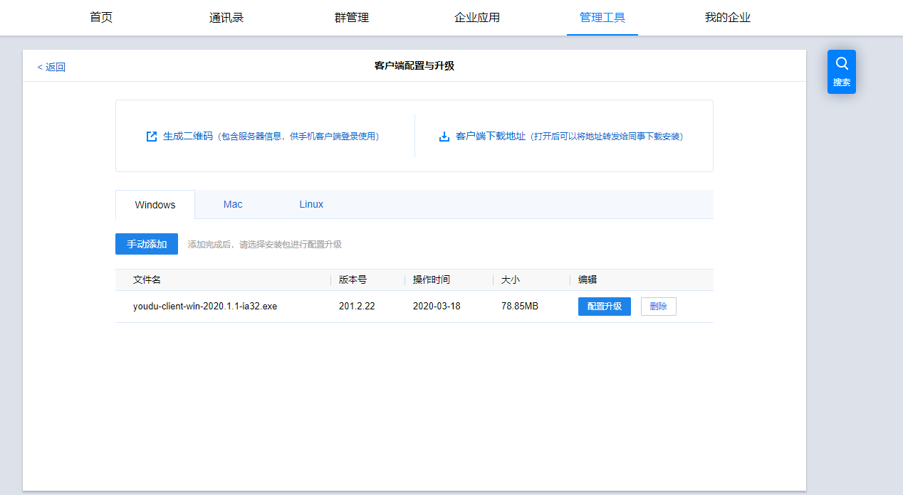

?>此文档主要面向管理员编写，如员工遇到客户端问题，建议先通过员工常见问题进行排查，排查后仍无法解决可以联系单位管理员。如果此指引未能解决管理员问题，请提交[工单](https://kf.youdu.im)，或者[联系我们](_support.md)。

## 基本功能使用

### 如何访问有度管理后台

　　打开浏览器，输入有度管理后台地址：http://服务器IP:7080/userportal

?>建议通过谷歌、火狐等浏览器访问。使用360等浏览器时，建议切换到内核、极速模式。

### 如何扩容授权用户数

　　在有度管理后台，点击【首页】左上角中的扩容按钮，填写相关信息后发送申请，会有专人联系。


### 如何添加多个有度后台管理员

　　有度管理后台支持添加多个管理员具体操作如下：

　　访问有度管理后台-【我的企业】-【权限管理】-【分级管理】-【超级管理员组】-【设置】，勾选组织架构中需要添加管理员权限的账号即可。

### 如何禁用有度账号登录

　　登录有度管理后台，在【通讯录】中存在授权名单和禁用名单，管理员可通过对授权名单和禁用名单进行账号的设置达到登录授权的划分的目的。

### 如何限制用户传输文件大小

　　登录有度管理后台，在【我的企业】-【聊天管理】-【文件传输限制】中。可对单个文件传输大小、P2P文件传输、互联企业文件传输进行限制，以达到限制用户传输文件大小目的。

### 如何配置客户端升级

　　登录有度管理后台，在【管理工具】-【客户端配置与升级】中，点击手动添加最新版本有度客户端进行配置升级；客户端在重新登录之后，便会收到服务端的新版本下载推送通知，升级使用即可。



## 进阶使用和设置

### 有度服务端防火墙设置要求

安装完成后，如果服务器或者网络硬件设备有防火墙，需要映射如下端口： 

1) TCP 7080，服务器服务查询端口（**注意：客户端登录时填写的是这个端口**）； 

2) TCP 7006，服务器登录端口，实际对外提供登录服务； 

3) TCP 7443，后台服务均通过此代理端口对外提供服务； 

从 RTX 腾讯通升级到有度即时通的用户需要注意，如果是有度服务器和 RTX 服务器分 

开部署在两台服务器上的情况，则需要在额外开放一个 TCP 7014 端口，否则 RTX 和有度服务器之间将无法正常并行使用。 

为使推送服务正常运行，本服务器需要能访问以下地址、端口： 

1） TCP80、TCP443，youdu.im(有度官网)； 

2） TCP80、TCP443, api.youdu.im（有度推送通道）； 

3） TCP443，api.vmall.com（华为推送通道（接口））； 

4) TCP443，login.vmall.com（ 华为推送通道（验证））； 

5) TCP443，api.xmpush.xiaomi.com（小米推送通道）； 

6) TCP2195，gateway.push.apply.com（苹果推送通道）； 

7) TCP 2196，feedback.push.apply.com（苹果推送通道（反馈））；

### 如何设置防火墙入站规则

- Windows server 2008以上，win7以上

1. 打开控制面板——Windows防火墙，单击左侧的“高级设置”。


2.选中入站规则，右键单击“新建规则”。

3.单击“端口”，下一步。

4.输入7006,7080,7443。此处注意逗号为半角“,”


5.继续下一步。

6.输入规则名称，完成即可。

- CentOS7系统

firewall-cmd --zone=public --add-port={7006,7080,7443}/tcp --permanent && firewall-cmd --reload && firewall-cmd --zone=public --list-ports


- CentOS 6、ubuntu16.04

  iptables -I INPUT -p tcp -m multiport --dports 7006,7080,7443 -j ACCEPT && service iptables save && service iptables restart

### 如何修改有度对外网开放的端口

　　有度需要对外网开放7006、7080、7443三个端口；以下以Windows为例讲解对外端口的修改办法：

1、在有度服务器上，登录mysql（可以使用sqlyog等工具)。

2、执行以下语句：

```mysql
use emoa_dns;
update t_service_addr set port=7006的新端口号 where port=7006;
update t_service_addr set port=7080的新端口号 where port=7080;
update t_service_addr set port=7443的新端口号 where port=7443;
```

3、修改配置文件

进入有度服务器Youdu\Server\config文件夹：

-修改svrlist.ini，

找到[jgmfrontd]，`info.port = 7006的新端口号`

-修改jgproxy.ini：

修改`[:7080]`为`[:7080的新端口号]`

修改`[:7443]`为`[:7443的新端口号]`

4、修改打开功能配置

修改Server/apps/clockapp/config.properties

加一个配置项，`app.addr=127.0.0.1:7080的新端口`

5、重启服务

在有度经常中，杀掉以下进程即可（会自动重启):

jgmfrontd、jgproxyd、jgclockapp

### 如何实现有度的第三方登录认证

1、在有度管理后台—企业应用—组织架构同步接口中，点击选用【通过调用接口同步】

2、在该页面中的URL里配置第三方认证服务的地址，该服务实现具体的认证过程，由第三方服务商提供

3、在有度后台的通讯录中，将需要第三方认证的人员的认证方式设置为【第三方认证】

4、程序DEMO文件下载地址：https://github.com/youduim/authdemo

5、[【配置说明文件】](https://teams.cindacode.com/download/attachments/1902991/有度第三方登录认证配置说明.docx?version=1&modificationDate=1560411171999&api=v2)

### 如何批量修改帐号的认证方式为第三方认证

如果仅修改单个、个别帐号为第三方认证，可以到管理后台直接对帐号进行修改。如果有批量修改需要，可以到数据库操作。

修改思路：设置帐号的authtype的值为2。

说明：0是有度本地认证，1是RTX认证，2是第三方认证（例如LDAP）

方法：

1.数据库查询语句（建议先查询确认下）：

SELECT account,chsname FROM emoa_acc.t_gid WHERE acctype=0 AND authtype=0 AND deleted=0 AND buin=总机号;

2.数据库更新语句：

update emoa_acc.t_gid set authtype=2 WHERE acctype=0 AND authtype=0 AND deleted=0 AND buin=总机号;

3,重启jgaccount进程生效。

### 与RTX并行时，有度如何直接到LDAP认证

1. 在服务器的svrlist.ini修改jgaccount,添加：

　　`private.rewrite_ldap_auth_type = true`

2. 重启jgaccount
3. 有度后台配置LDAP，但是不同步，关闭自动同步。
4. 完成

### 有度企业版（本地部署版）需要访问有度官网youdu.im的作用是什么

　　在有度企业版的管理后台中，有访问有度开放平台的链接入口，该入口需要能访问有度官网。

### 有度客户端消息收发过程

　　　可以查看功能逻辑中的[有度消息收发](admin/functions/消息收发)。

1. 客户端通过TCP(TLS Socket)通道登录成功，服务器返回用于https信息交互的token。
2. 客户端将发送消息内容先进行base64，然后放进json协议包。
3. 客户端将json协议包和token，通过https协议提交给服务器。
4. 服务器验证token身份合法，将整个json数据包进行加密，把加密后的消息保存进leveldb或mongdb。

### 有度客户端内置浏览器用的什么内核

　　iOS、Mac端使用的是系统自带的webkit内核webview浏览器；Mac端部分情况会直接调用系统默认浏览器。

　　android客户端用的是系统自带webkit内核webview浏览器

　　Windows客户端用的Webkit内核webview浏览器

### 有度客户端内置浏览器的缓存时间是多久，用户是否可以控制缓存时长

　　有度客户端目前没有加缓存；企业自己的WEB应用，可以在服务器返回的响应头中加入Expires策略或者Cache-Control策略来告诉客户端应该执行的缓存行为，同时配合#Last-Modified#等头来控制刷新的时机。

### 有度客户端发送消息到服务器的过程

1、客户端通过TCP(TLS Socket)通道登录成功，服务器返回用于https信息交互的token。

2、客户端将发送消息内容先进行base64，然后放进json协议包。

3、客户端将json协议包和token，通过https协议提交给服务器。

4、服务器验证token身份合法，将整个json数据包进行加密，把加密后的消息保存进leveldb或mongdb数据库。

### 有度客户端都支持哪些设备

| 设备编号 | 设备名称         | 设备编号 | 设备名称                 |
| -------- | ---------------- | -------- | ------------------------ |
| 0        | PC；各类台式电脑 | 6        | Web客户端（已停止支持）  |
| 1        | 苹果iphone手机   | 7        | 微信企业号（已停止支持） |
| 2        | 苹果ipad         | 9        | 华为手机                 |
| 3        | 各类android手机  | 10       | 小米手机                 |
| 4        | 各类android Pad  |          |                          |
| 5        | 苹果Mac电脑      |          |                          |

### 如何开启网络带宽限流

　　用户由于大群并发下载文件导致服务器带宽异常的高，内部其他服务出现500，无法响应；可以通过如下限流措施，可以防止带宽被占满而导致其他服务不可用的问题。

1. 对接口请求数量进行限制


　　在有度服务器，打开jgproxy.ini配置文件，添加以下配置项：

```ini
[urllimit] 

/v3/api/jgfile/download = 100	//限制文件下载请求100个/s 

/v3/api/jgfile/download.original.image = 100 // 限制下载原图100个/s
```

2. 对网络带宽进行限流


　　在jgproxy.ini配置文件中，common segment下添加：

```ini
netMonitorOn = 1   // 打开网络限流开关 

maxPermitNetUsage = 95  // 最大允许网络占用百分比 

netMonitorCheckDuration = 5  // 检测时间间隔,单位: 秒 

netBandwidth = 100  // 网络带宽：100, 单位: Mbps 
```

　　上述数据当前逻辑判断,五秒内产生的流量是否大于100Mb * 0.95,大于则限流禁用jgfile=

### 关闭文件自动上传群空间功能

　　提供版本：2020.1 

1. 修改 config/svrlist.ini 文件，[jgfiled] 下添加

　　`private.nonAutoSaveGroupFile = 1` 

2. 重启jgfile

3. 参数说明

?>0：存储。默认没有此项，为开启。  
  1：不存储。

### 误删除账号该如何恢复

　　在有度管理后台删除某个账号，实际只打了一个删除标识，并没有物理删除，通过以下操作可以恢复该账号。

1. 在有度服务器上，使用数据库工具（如SQLYOG）连接到MYSQL，在emoa_acc.t_gid表中找到该账号记录，修改字段deleted=0。

2. 重启jgaccount（在有度服务器进程中杀掉该进程即可，会自动重启）

3. 在有度管理后台的通讯录中搜索到这个用户，重新设置一下该用户的部门信息。

## 故障
### 排查思路

1. 确认客户端环境无误，例如系统、网络；
2. 检查客户端到服务器的网络访问，例如7006,7080,7443端口；
3. 检查服务器的CPU、内存、磁盘IO、磁盘空间；
4. 最后可以看下服务端安装目录/log下的log日志，例如jgservice.log

### 登录提示无法获取服务器地址

1. 客户端访问地址是否正确；
2. 7006,7080,7443端口通不通，均为TCP协议；
3. 如果需要外网登录，请做端口映射；
4. 内网服务器，请设置静态IP，不要使用DHCP获取IP；

### 登录提示无法连接服务器

1. 服务器防火墙是否开放7006端口；
2. 服务端的jgmfront服务是否正常；

### 登录提示服务器繁忙

1. 检查服务器资源负载是否正常；
2. 如果帐号是第三方认证，第三方认证服务器、第三方认证设置、第三方认证插件等是否正常；
3. 查看jgauth服务是否正常；

### 消息收发失败

1. 检查服务器网络是否正常；
2. 检查服务器磁盘空间是否充足；
3. 检查mysql服务是否正常；
4. 检查服务器的整体运行情况，包括CPU

### 文件传输失败

1. 测试文字消息是否正常；
2. 如果文字消息正常，直接检查服务器的jgfile服务。如果文件服务独立部署，直接查看文件服务器情况；
3. 服务器磁盘空间是否充足；
4. 客户端报错503，CPU使用是否一直100%,如果检测到100%连续5次，会停止文件服务（jgfile），待服务器CPU资源恢复正常后即可。此时您应该关注服务器性能情况，必要时可以考虑[文件服务独立部署](admin/unctions/filesvrdeploy)。

### 有度客户端搜索不到联系人

几种情况：

1. 联系人实际存在，但搜不出来

2. 联系人改过名字，但搜到的还是老的，组织架构显示的又是正确的

　　解决办法：在有度服务器进程中杀掉jgaccount进程（会自动重启）再试。

### 有度客户端文件上传网盘失败

  在有度服务器进程中，杀掉 jgminio、jgnetdisk两个进程即可（系统会自动重启）。您使用的服务端版本可能比较旧，请更新到[官网版本](https://youdu.im/download.html)。

### Windows重装有度后服务启动不了，命令窗口提示指定的服务已标记为删除

1、升级有度服务，完成后管理后台登录不了，提示网页不存在。

2、检查发现安装youdu_mysql的时候提示“指定的服务”已标记为删除。

3、检查注册表项，将HKEY_LOCAL_MACHINE\SYSTEM\CurrentControlSet\Services下的mysql项目删除，重启服务器，重装有度服务端，解决问题。

###　Linux有度服务无法启动

1. 查看您有度目录、文件，是否有权限运行；
2. 查看selinux是否关闭，部分系统的selinux可能会影响有度服务运行；
3. 若排查系统环境后，可以查看jgservice，是否有异常服务在重启；

### 有度管理后台启用了打卡应用，在手机客户端中没有显示打卡应用，该怎么解决

1. 有度管理后台-企业应用-应用模板管理中的默认模板里，看是否有添加打卡应用。

2. 有度管理后台-启用应用页面，看看是否有新建“应用门户模板”，如果有，查看一下是否有添加打卡应用。

3. 查看一下手机端-工作面板-设置，是否存在打卡应用可选添加项。

### 如何手动修改讨论组人数上限
在管理后台-我的企业-聊天管理，可以手动选择上限人数。部分用户可能需要自定义一个值，可以参考此方法。
1. 登录mysql

2. 例如，设置10人。执行sql语句

  ```mysql
  use emoa_auth;
  update ent_role_right set rightValue=10 where rightid="client_open_multiple_session";
  ```

3. 重启进程jgauth、jgmsg。

4. 客户端重新登录生效。

### 文件收发失败，服务器返回503服务不可用

?>说明：服务器有触发文件服务停止的机制。当服务器的CPU使用率达到95%以上，jgproxy会停止文件服务，所以请求会无法响应，这是为了防止服务器的性能进一步恶化。

!>出现此情况，说明服务器的CPU负荷较高，建议及时查看是哪些进程占用高导致的，如果是进程问题，联系我们分析，如果是服务器性能不足，请扩容CPU。

如果想关闭或调整，可以编辑配置文件config/jgproxy.ini，修改[common]段，修改完毕后重启jgproxy生效。以下是说明：

```
cpuMonitorOn
#开关，默认为1开启，0关闭。

maxPermitCpuUsage
3CPU使用率触发阈值，默认95（%）。

cpuMonitorCheckDuration
#监控间隔，默认5秒
```

### mysql报错提示1129，many connection

有度数据库报错，导致有度服务不可用；查看mysql日志，提示连接数过多many connection。通过以下办法解决：

1. 登录mysql查看现在的连接数多大：show VARIABLES like 'max_connect%'

2. 设置mysql连接数，登录mysql执行以下语句

```mysql
set GLOBAL max_connects = 500;
set GLOBAL max_connect_errors = 1000;
```

3. 刷新主机连接活动：flush hosts;

4. 配置文件在`[mysqld]`添加参数

   ```ini
   GLOBAL max_connects = 500
   GLOBAL max_connect_errors = 1000
   ```

5. 如果使用了mysqlrouter,需要重启该服务。


### 服务器断电导致MySQL服务无法启动，提示1067，如何恢复可用

原因分析：断电可能导致mysql数据损坏，数据损坏后将影响服务不可启动，所以不可用。

解决思路：尝试恢复mysql数据使用，如果恢复失败则恢复backup数据使用，并告知用户仅可包含组织架构、群、会话列表。

解决方法：

1.停止有度服务；

2.编辑有度配置文件Youdu/server/config/service.ini，将jgmfront的start改为stop,保存退出；停止jgmfront的作用是防止客户端连上服务器，在这种异常情况下可能出现其它问题。虽然第一步停止了有度服务，但是可能误操作启动或为后面重装服务端做准备；

3.使用innodb_force_recovery参数尝试启动有度服务

innodb_force_recovery = 1

**数值强烈建议从1逐步提升为6，不要直接设置为6。如果提升为6时仍然无法启动mysql服务，说明mysql数据彻底损坏。**不同级别的说明可以参考 https://www.cnblogs.com/glon/p/6728380.html

4.mysql服务启动成功后，马上使用mysqldump将数据全部备份

mysqldump -uroot p - all-databases -v > backup.sql

5.停止mysql服务；

6.重命名Youdu/Server下的ydmysql文件夹；

7.准备相同版本的服务端安装包，重装服务端；

8.停止有度服务；

9.恢复mysql数据；

10.编辑有度配置文件youdu/server/config/service.ini，将jgmfront的stop改为start,保存退出。

11.故障恢复完成，登录客户端检查功能；

注意：如果用户多次出现断电mysql数据损坏的情况，建议用户将有度服务端迁移至一个稳定的服务器环境。