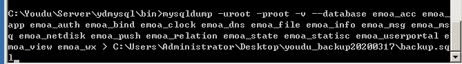

# MySQL数据库独立部署

## 说明

　　Windows版有度服务端默认已经集成MySQL数据库，无需单独安装。Linux版有度服务端没有集成，需要自行安装。

　　通过本文档，您可以了解MySQL数据库如何安装，MySQL的数据如何备份恢复，在有度服务端中如何重新配置连接MySQL。在单机情况下，服务器的负载较高时，可以考虑将MySQL拆分独立部署，保障MySQL的性能，提高运行速度。

?>本文只做示例，如果您已经有相关使用经验，可以根据您自己的实际情况进行配置。

## CentOS 7安装MySQL Server 5.7

### 设置yum源

```
cat > /etc/yum.repos.d/mysql-community.repo <<eof
[mysql57-community]
name=MySQL 5.7 Community Server
baseurl=https://mirrors.cloud.tencent.com/mysql/yum/mysql57-community-el7/
enabled=1
gpgcheck=1
gpgkey=http://repo.mysql.com/RPM-GPG-KEY-mysql
eof
```

### 开始安装

```
yum -y install mysql-server mysql
```

### 增加配置参数

```
cat >> /etc/my.cnf <<eof
innodb_buffer_pool_size = 256M
max_connections = 500
max_connect_errors = 1000
group_concat_max_len = 102400
eof
```

?>如果该服务器的内存充裕，我们建议您提高innodb_buffer_pool_size大小。

### 初始化mysql

```
mysqld --initialize-insecure --user=mysql
```

### 启动mysql

```
systemctl start mysqld
```

### 设置root密码

```
mysqladmin -uroot password 'Youdu123!!'
```

## MySQL授权有度服务器远程访问

　　例如有度服务器的IP是192.168.1.100，进行以下操作：

1. 登录mysql

```
mysql -uroot -p
```

2. 执行语句

```
grant all privileges on *.* to 'root'@'192.168.1.100' identified by 'Youdu123!!';
```

3. MySQL Server默认监听3306端口，如果有防火墙，请对有度服务器开放此端口。

　　例如firewalld：

```
firewall-cmd --permanent --add-rich-rule="rule family="ipv4" source address="192.168.1.100" port protocol="tcp" port="3306" accept"
firewall-cmd --reload
```

!>以上配置完毕后，建议从有度服务器测试是否能远程访问。

## Windows 导出MySQL Server数据

1. 打开系统服务，停止服务名称为“youdu_service”的有度服务。
2. 打开任务管理器，选择进程或详细信息，键盘输入youdu，右键youdu_mysql进程，点击打开文件位置。

2. 按住shift键不放同时右键空白区域，点击在此处打开命令窗口。

3. 输入备份命令：

   ```COMMAND
   mysqldump -uroot -proot -v --database emoa_acc emoa_app emoa_auth emoa_bind emoa_clock emoa_dns emoa_file emoa_info emoa_msg emoa_msq emoa_netdisk emoa_push emoa_relation emoa_state emoa_statisc emoa_userportal emoa_view emoa_wx > 目标备份路径\backup.sql
   ```

例如：



## Linux 导出MySQL Server数据

1. 停止有度服务

```shell
systemctl stop youdu_service && systemctl disable youdu_service
```

2. 执行备份命令

```shell
mysql -uroot -p -e"show databases"|grep -E "emoa"|xargs mysqldump --databases -uroot -p -v > backup.sql
```

## 拷贝SQL备份数据到新的数据库服务器

　　例如通过sftp拷贝。

## Windows 导入MySQL Server数据

1. 打开mysql安装目录下的bin目录。

2. 按住shift键不放同时右键空白区域，点击在此处打开命令窗口。

3. 输入恢复命名：

   ```
   mysql -uroot -p -v < backup.sql
   ```

## Linux 导入MySQL Server数据

```shell
mysql -uroot -p -v < backup.sql
```

## 有度服务端修改MySQL访问配置

1. 进入有度服务端安装目录下的bin目录。
2. 执行mysqldburlcfg，根据提示，输入新的mysql帐号、密码、地址、端口。

　　例如Linux：

```
./mysqldburlcfg
```

!>Windows版有度服务端可能没有自带mysqldburlcfg，可联系有度技术支持获取。

## 启动有度服务

　　以上操作完成后，启动有度服务即可。