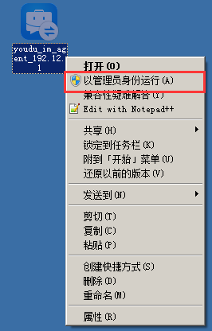
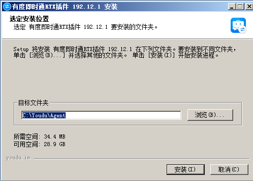
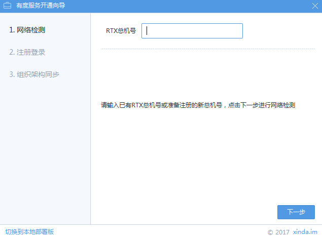

# 有度RTX插件配置指南 {docsify-ignore-all}

## 关于云免费版和本地部署版的说明

?>服务端分为云免费版和本地部署版，一般推荐使用本地部署版。

|                | 云免费版                                    | 本地部署版                                                   |
| -------------- | ------------------------------------------- | ------------------------------------------------------------ |
| 运行环境       | 有度提供云SaaS环境                          | 用户提供服务器，支持内网本地部署、云服务环境部署。           |
| 授权数         | 50人                                        | 200人以内每半年免费续期一次授权；200以上请联系[商务购买](https://youdu.im/contact.html)，支持试用。 |
| 管理后台       | 支持创建3个企业应用，大部分功能会受到限制。 | 无功能限制                                                   |
| 一般的使用场景 | 和RTX搭配，作为RTX手机端使用。              | 除了支持作为RTX手机端使用，也可以独立部署使用，可以过渡切换使用。 |
| 适合企业类型   | 小微企业、工作室。                          | 大型集团，中小企业，机关、事业单位等组织。                   |

## 安装前的检查

- [ ] RTX服务端是否为2015版本，如果低于2015建议升级，否则可能存在异常问题。RTX升级请看：https://rtx.tencent.com/rtx/download/index.shtml
- [ ] 已安装有度服务端，详情请看安装文档。

## 安装位置的说明

　　　有度RTX插件需与RTX服务端安装在同一个服务器上，本地部署版的有度服务端可以装到其它服务器，我们也建议您分开部署。

 　　如果在RTX服务器上安装有度本地部署版服务端，无需配置插件，直接启动插件服务即可。

?>启动方法：点击开始菜单-有度即时通RTX插件，点击打开有度即时通RTX插件，

## 获取插件安装包

　　下载地址：https://youdu.im/rtx.html

## 以管理员身份运行插件

## 点击安装

## 点击完成

## 本地部署版

## 输入您RTX的总机号

　　输入完成后，点击“下一步”。

## 如果还未注册，会提示