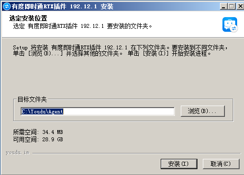

## RTX版本检查

　　RTX服务端版本要求不低于2015，如果较低建议升级，否则可能存在异常问题。

　　RTX升级请看：https://rtx.tencent.com/rtx/download/
　　
## 插件介绍

　　由原RTX技术专家带领团队开发，全面兼容RTX，是腾讯官方认证的RTX手机端解决方案，前身是信达通讯录。

　　有度除了可以和RTX并行同步使用，也可以独立运行使用，是完整的RTX升级方案。详细的介绍请看[官网](https://youdu.im)

## 关于有度服务端云免费版和本地部署版的说明

?>服务端分为云免费版和本地部署版，一般推荐使用本地部署版。

|                | 云免费版                                    | 本地部署版                                                   |
| -------------- | ------------------------------------------- | ------------------------------------------------------------ |
| 运行环境       | 有度提供云SaaS环境                          | 用户提供服务器，支持内网本地部署、云服务环境部署。           |
| 授权数         | 50人                                        | 200人以内每半年免费续期一次授权；200以上请联系[商务购买](https://youdu.im/contact.html)，支持试用。 |
| 管理后台       | 支持创建3个企业应用，大部分功能会受到限制。 | 无功能限制                                                   |
| 一般的使用场景 | 和RTX搭配，作为RTX手机端使用。              | 除了支持作为RTX手机端使用，也可以独立部署使用，可以过渡切换使用。 |
| 适合企业类型   | 小微企业、工作室。                          | 大型集团，中小企业，机关、事业单位等组织。                   |

## 有度RTX插件的安装位置说明

　　云免费版：装在RTX服务器上。详情请看[云免费版配置](#云免费版配置)。　　

　　本地部署版：

1. 有度服务端与RTX服务端分别安装在不同的服务器上，RTX服务器安装有度RTX插件。我们建议您采用此架构，详情请看[本地部署版配置](#本地部署版配置)。
2. 有度服务端和RTX服务端安装在同一个机器上，无需再另外安装、配置插件，已包含插件，直接启动插件服务即可。

?>启动方法：开始菜单-有度即时通服务端-有度即时通RTX插件，点击“启动服务”。

## 获取安装包

有度服务端安装包：https://youdu.im/download.html

有度RTX插件下载地址：https://youdu.im/rtx.html

## 云免费版配置

1. 以管理员身份运行插件。

2. 点击安装。

3. 点击完成。

4. 输入RTX总机号，点击“下一步”。

5. 同步完成

5. 注册或登录后，即可使用，客户端通过总机号登录有度即可。

## 本地部署版配置

### 有度服务器安装有度服务端

   详情请看[安装指南](admin/server_install/server_install)

### RTX服务器安装、配置有度RTX插件

1. 以管理员身份运行插件。

2. 点击“安装”。

3. 点击“完成”。

4. 点击“切换到本地部署版”，点击“确定”。

5. 输入有度服务器IP地址。

?>如果此步不通，请检查有度服务器是否开放7080,7443,7014的TCP端口访问。

6. 输入连接码

?>登录有度管理后台，点击我的企业-高级设置-RTX集成，即可查看连接码。

7. 同步完成

8. 有度客户端设置有度服务器地址，使用RTX帐号即可在有度登录。