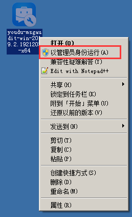
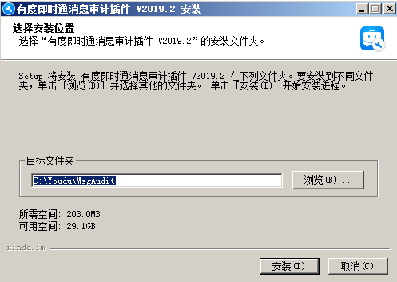
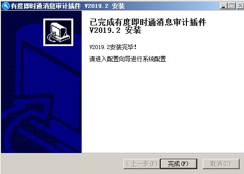
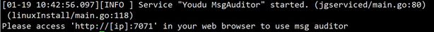
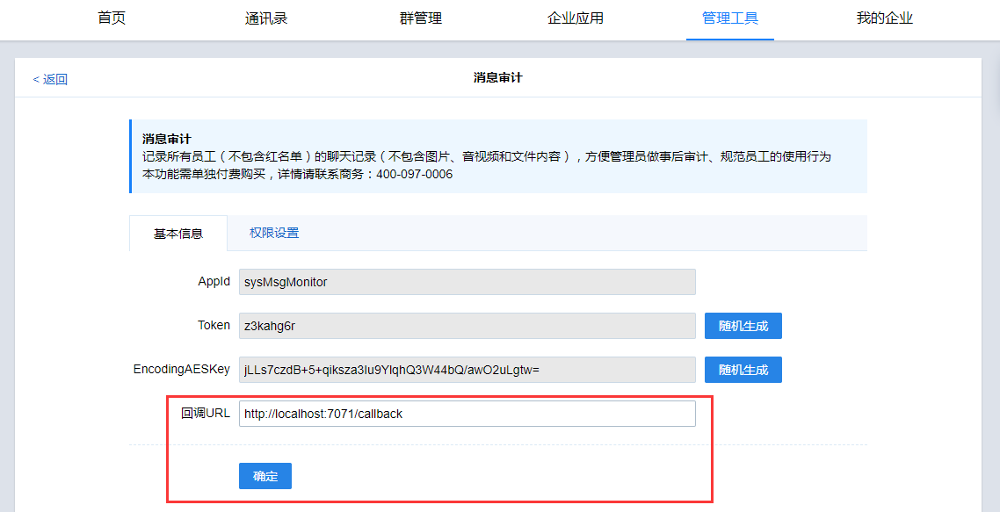

# 消息审计安装指南

## 关于消息审计的说明
- 消息审计用于审计用户的聊天记录，属于增值插件，如有需要可以联系[商务咨询](tencent://message/?uin=2850184511&Site=www.xinda.im&Menu=yes)。
- 获取消息审计安装包，可以[联系我们](https://youdu.im/contact.html)。

## 有度服务端要求

　　在安装消息审计之前，您需要确保您的有度服务端为[官网最新版本](https://youdu.im/download.html)，您可以参考[升级指南](admin/server_upgrade/server_upgrade)。

## 防火墙策略

| 源地址             | 目标地址     | 端口      | 说明           |
| ------------------ | ------------ | --------- | -------------- |
| 消息审计管理员电脑 | 消息审计插件 | 7070      | 访问插件后台   |
| 有度服务端         | 消息审计插件 | 7071      | 回调消息至插件 |
| 消息审计插件       | 有度服务端   | 7002,7443 | 服务内部通讯   |


## Windows版安装步骤

### 右键以管理员身份运行安装包



### 点击安装



### 安装完成




## Linux版安装步骤

?>此处以CentOS 7作为系统环境演示，其它发行版系统请自行查阅相关信息，步骤大同小异。

### 安装MongoDB

```
cat > /etc/yum.repos.d/mongodb‐org‐4.2.repo <<eof
[mongodb‐org‐4.2]
name=MongoDB Repository
baseurl=https://mirrors.aliyun.com/mongodb/yum/redhat/7/mongodb‐org/4.2/x86_64/
gpgcheck=1
enabled=1
gpgkey=https://www.mongodb.org/static/pgp/server‐4.2.asc
eof
yum install ‐y mongodb‐org
systemctl start mongod
```

### 上传消息审计插件安装包

### 解压安装包

```
tar xvf name.tar.gz
```

### 进入解压目录的bin目录下

```
cd 解压目录/bin
```

### 执行安装脚本（安装路径不能指定安装包路径）

```
./linuxInstall /usr/local/youdu_audit
```

### 输入mongodb服务地址、端口

```
localhost:27017
```

### 安装完成



## 修改消息审计插件配置文件

!>如果消息审计插件和有度服务端（主服务器）在一个服务器上， 不需要修改,可以忽略这一步。

```
1	#编辑配置文件
2	vim /usr/local/youdu_audit/audit/conf/app.conf
3
4	#修改总机号
5	buin = 主服务器总机号
6
7	#修改主服务器访问地址
8	youdu_api_addr = http://ip:7080
9
10	#修改消息审计的key
11	youdu_api_key = 主服务器，可以在管理后台‐管理工具‐消息审计中查看EncodingAESK y
12
13	#重启消息审计服务
14	systemctl restart youdu_audit
```

## 登录有度后台，管理工具-消息审计，填写消息审计插件的回调地址URL。
　　例如，装在有度服务器上：

```
http://localhost:7071/callback
```

　　装在其它机器：

```
http://audit_IP:7071/callback
```




## 打开浏览器，输入消息审计插件访问地址

　　http://audit_ip:7071