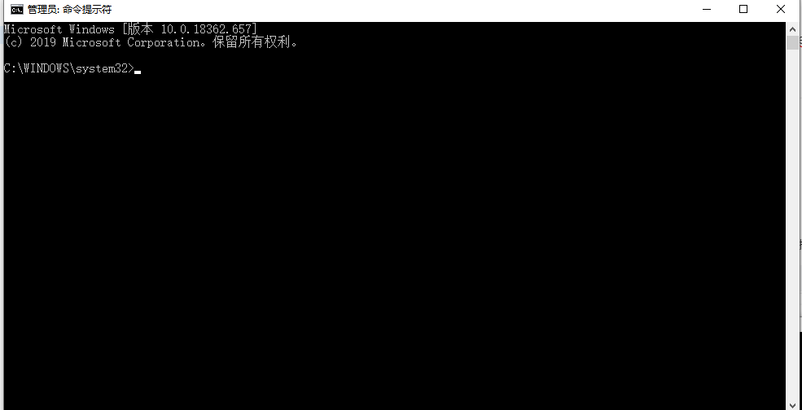
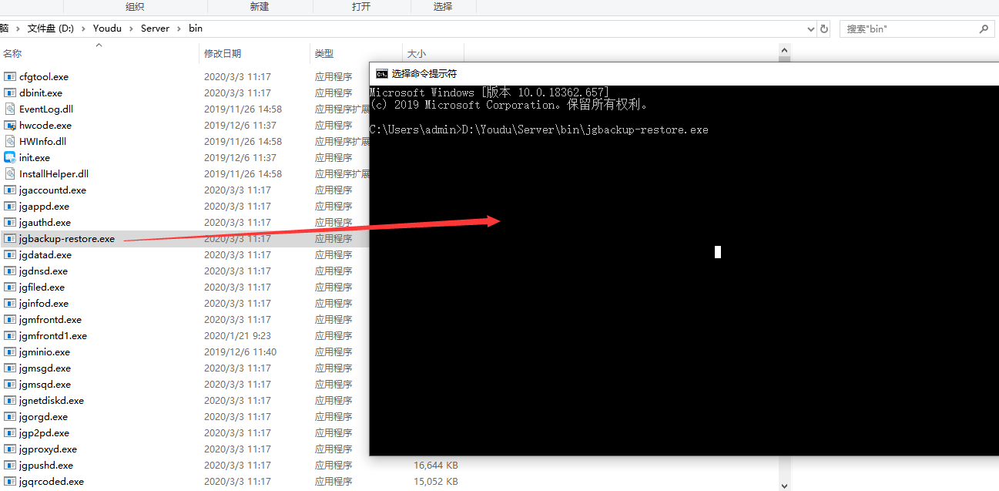
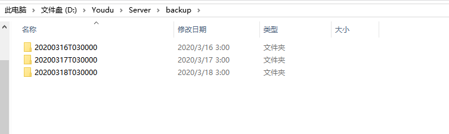
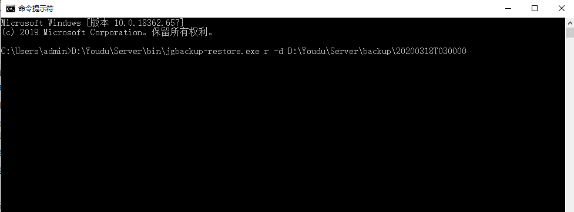
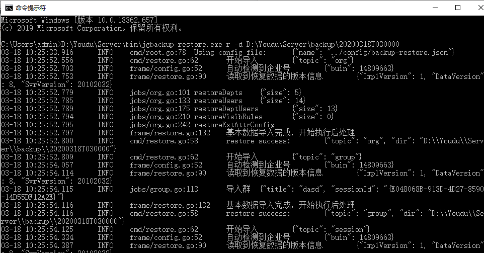
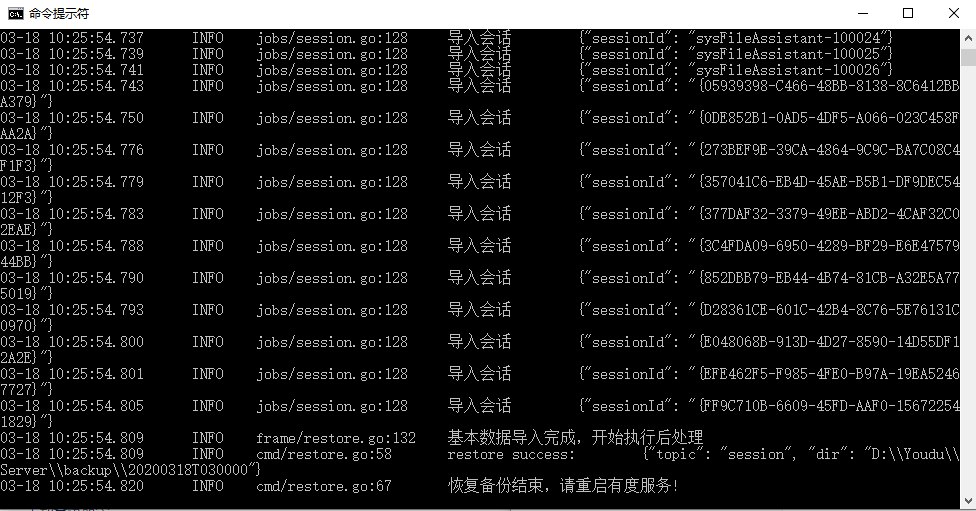
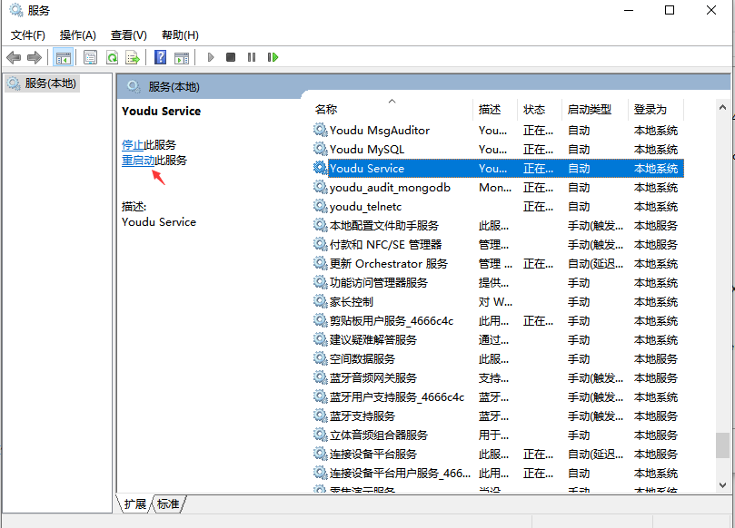
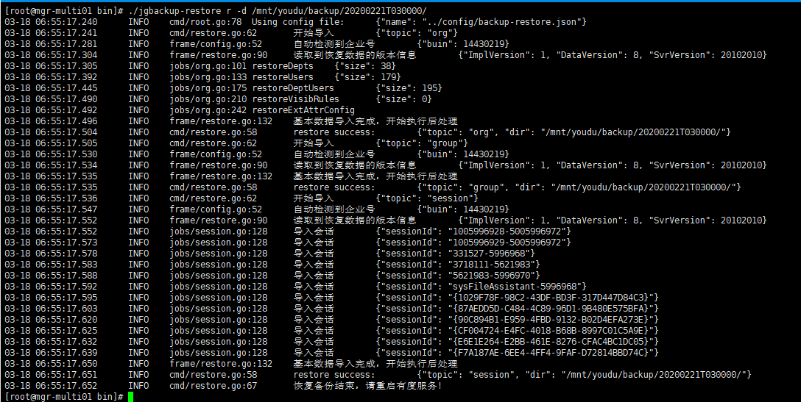

# 有度服务端备份数据恢复指南

## 备份说明

- 有度支持自动备份功能，默认每天凌晨3点自动备份数据。

- 备份数据范围：通讯录人员信息、可见性配置信息、群和会话列表（不包括消息记录）。

  !>此处的自动备份数据一般只用于服务器出现致命故障使用，例如服务器数据丢失数据、无法恢复的情况下。不适用于迁移，迁移请查看[迁移指南](admin/server_move/server_move.md)。


## 自动备份

- 备份策略说明

　　可以登录管理后台-管理工具-备份和恢复，查看数据自动备份设置说明。


- 相关配置文件

  服务端安装目录/server/config/backup-restore.json
- 备份数据存储目录

   服务端安装目录/server/backup，您可以在配置文件中定义。
   
  !> 强烈建议您使用第三方同步工具，定期自动同步backup目录至其它服务器，避免备份数据丢失，以防万一。

## Windows系统

1. 运行命令提示符。




2. 将安装目录Youdu/server/bin下的jgbackup-restore.exe程序直接拖进命令提示符。



?>数据默认保存路径：最近三天相关数据存放于Youdu/Server/backup下，建议选择最新一天的目录进行恢复。




3. 输入命令执行，如下图所示：

   ```
   jgbackup-restore r -d 数据目录路径
   ```



参数解释：

```
  r //修复动作。
  -d //指定数据目录路径。
```

  

4. 开始数据恢复



5. 恢复备份完成，请重启有度服务。



6. 重启有度服务，完成自动备份数据恢复。



## Linux系统

1. 确认有度服务端安装路径。

2. 切换到有度安装路径，例如/mnt/youdu/bin下（以实际路径为准），执行脚本jgbackup-restore，命令如下图示：

```
./jgbackup-restore r -d /mnt/youdu/backup/20200221T030000/
```



参数解释：

```
r //为重新加载的意思。
-d //指定存储路径。
```

3. 恢复备份数据完成，使用以下命令重启有度服务。

```bash
systemctl restart youdu_service
```

## 恢复完成后进行测试

　　以上步骤顺利执行完毕后，您的恢复已经完成。

　　对于服务端：请打开谷歌浏览器，登录有度后台 https://server-ip:7080/userportal 查看后台数据是否正常。

　　对于客户端：请进行登录、消息收发、组织架构、企业应用等功能的测试。

?>恢复完成后如果有问题，经过自查后仍未解决，可以在工单系统或技术支持QQ联系我们[请求协助](./README)。