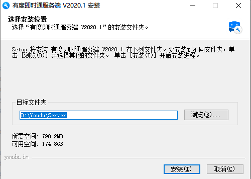
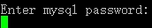
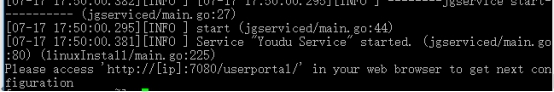

# 有度服务端全新部署指引

## 安装说明

!>如果您没有Linux系统的命令使用等经验，**建议您使用windows版本，功能相同，支持一键安装部署。**

　　服务端下载地址：https://youdu.im/download.html

1. 本文内容基于CentOS 7作为操作系统环境进行编写，其它Linux发行版的有度服务端安装方法大同小异，请您根据实际情况进行安装。

2. 安装过程中遇到问题需协助，请通过以下方式联系我们：

- 提交工单（**建议**）：https://kf.youdu.im

- 客服QQ：https://youdu.im/contact.html

- 直接与您的客户经理取得联系。

## 防火墙说明

　　入站需开放7006,7080,7443端口，均为TCP协议。如果您的网络中还存在其它防火墙，也请考虑是否需要开放。

  　　详细配置步骤可参考：[有度服务端防火墙设置要求](admin/admin_faq/admin_faq?id=有度服务端防火墙设置要求)

## 外网客户端登录的场景说明

　　如果您的客户端需要在外网（互联网）使用，您的服务器需要满足以下条件之一：

1. 如果您有固定的公网IP或者动态域名，请配置端口映射到服务器，外部端口需与内部端口一致。
2. 如果您没有固定的公网IP，可以联系您的客户经理，开通有度的远程登录增值服务。
3. 您也可以考虑将有度服务端部署在公有云使用，开通时选择公网IP。如阿里云、腾讯云、华为云、AWS、Google Cloud等云计算服务供应商。

?> 注意：公有云服务供应商与有度没有关系，您可以自行挑选开通服务器。

?>如果您不知道服务器所处网络有没有固定的公网IP，您可以尝试寻求网络管理员、网络服务供应商、网络设备供应商、服务器供应商的帮助，或者您可以联系我们，我们会尽量协助您判断该情况。

## 服务器配置要求

| 用户规模 | CPU  | 内存 | 硬盘 |   网卡速度   | 静态地址 |                  **系统**                  |
| -------- | ---- | ---- | ---- | :----------: | :------: | :----------------------------------------: |
| 200以下  | 2核  | 4G   | 100G |   100Mbps    |    是    | CentOS 7 及以上、Windows server 2008及以上 |
| 200-500  | 4核  | 8G   | 1T   | 100~1000Mbps |    是    | CentOS 7 及以上、Windows server 2008及以上 |
| 500以上  | 8核  | 16G  | 2T   |   1000Mbps   |    是    | CentOS 7 及以上、Windows server 2008及以上 |

?>注意：以上仅为建议，可根据实际需要调整配置。

>1. 凡是基于linux内核2.6.23及以上的版本，均支持。主流的Redhat、CentOS、Debian、Ubuntu、openSUSE、SUSE等发行版，国产系统如中标麒麟、银河麒麟、深度系统等均支持。
>2. 服务端的处理器架构支持x86_64，即支持64位，不支持32位。其它架构如龙芯等已在支持计划中，请留意官方更新。如无特殊要求，**建议您使用CentOS 7**。

## 数据库说明

　　有度即时通采用的数据库是MySQL Server；

　　如果您部署的是Windows服务端，则无需重新部署数据库使用，服务端在部署安装时，也会默认MySQL数据库并连接有度服务端进行使用，默认使用端口为13307，管理员账号密码默认都为root；

　　如果您部署的是Linux服务端，则需要先自行**部署MySQL数据库**，并且在部署有度服务端时，将星数据库连接配置，详细说明请查看linux服务端部署。

## Windows服务端部署

1. 从有度官网下载最新服务端版本，并上传至有度服务器，安装使用。

2. 在管理员权限下，运行服务端安装程序，根据实际情况选定有度服务端的安装路径；



   3. 安装完成之后，有度服务端会自动跳转访问有度管理后台，设置好管理员账号密码并做好记录，即可登录有度管理后台导入授权文件。


   4. 至此，有度服务端安装完成。

## Linux服务端部署

### 部署数据库

　　数据库采用MySQL Server，建议使用5.7版本，至少5.5版本。在安装有度服务端之前，请您确认数据库已经安装并且可以正常使用。并修改参数：

```
#1. mysql执行语句设置  

set global group_concat_max_len = 102400;

  

#2. 配置文件添加参数  

group_concat_max_len = 102400 
```

　　如果您还没有安装mysql，您可以在互联网自行搜索相关信息，或者参考下面的步骤：

1. 添加yum源  

```
cat > /etc/yum.repos.d/mysql-community.repo <<eof  
[mysql57-community]  
name=MySQL 5.7 Community Server  
baseurl=https://mirrors.cloud.tencent.com/mysql/yum/mysql57-community-el7/  
enabled=1  
gpgcheck=1  
gpgkey=http://repo.mysql.com/RPM-GPG-KEY-mysql  
eof   
```

2. 安装mysql  

```
yum -y install mysql-server mysql  
```

3. 优化参数  

```
cat >> /etc/my.cnf <<eof  
group_concat_max_len = 102400
eof  
```


4. 初始化mysql  
```
mysqld --initialize-insecure --user=mysql  
```


5. 启动mysql  
```
systemctl start mysqld  
```

6. 设置密码

```
mysqladmin -uroot password 'Youdu123!!'  
```


### 部署有度服务端

1. 上传安装包到有度服务器。

2. 解压安装包

   tar -xvf 压缩包名称.tar.gz  

3. 进入安装脚本目录

4. cd 解压目录/bin/  

5. 执行有度安装脚本

   ./linuxInstall 安装路径（不能选择安装包目录）

6. 输入mysql用户名

    

7. 输入mysql密码

    

8. 输入mysql服务地址、端口

    

9. 安装完成

    

10. 打开浏览器，输入有度管理后台地址，http://服务器IP:7080/userportal

