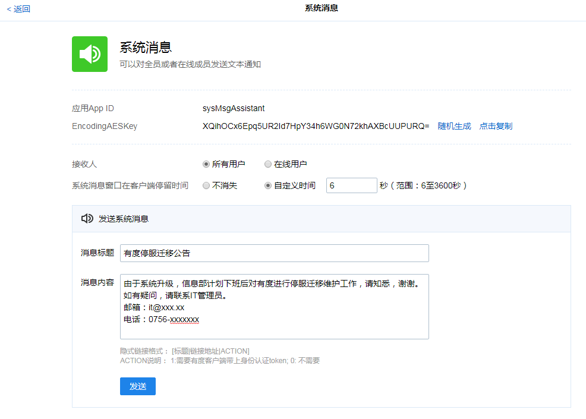
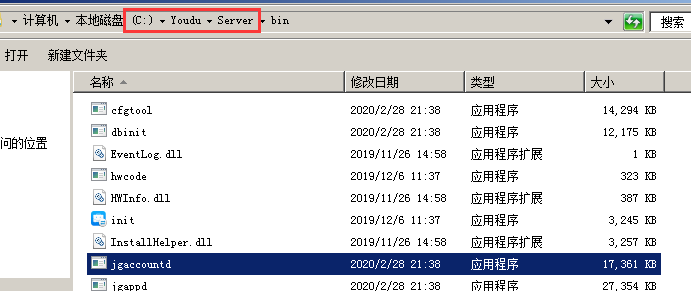
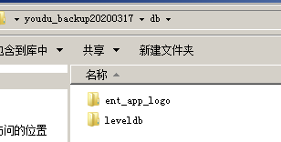

# 有度服务端迁移指南

## 旧服务器导出数据

- 如果您想模拟迁移过程，可以搭建一个测试环境后再进行测试。
- 如果您希望得到我们的协助，请到[工单系统](https://kf.youdu.im)提交您的问题。

!> 迁移前请对关键数据备份，以防万一，具体请参考备份介绍。

### 关于迁移的数据说明和建议

　　为了加快迁移速度，减少停服对客户端的影响，一般迁移包含以下核心数据：

- 通讯录（帐号、姓名、认证方式）
- 单人会话、讨论组、固定群
- 聊天记录中的文字消息、文件记录（非文件本身）
- 企业应用
- 管理后台设置
- 其它数据...

　　核心数据的迁移，根据历史经验，结合大部分用户千兆网络、机械硬盘、人为协作等环境因素，一般迁移用时在1小时左右基本完成。

　　**您可能注意到，聊天记录中的文件数据、网盘数据、群空间数据没有包含在内，有以下原因：**

- 核心数据是最高优先级的迁移任务，核心数据迁移完成后，新服务器就可以启动使用了。

- 核心数据是必须迁移的，文件数据、网盘数据、群空间数据，从业务系统的使用角度来看，不是必须的。

- 文件数据、网盘数据、群空间数据即使不迁移，不影响客户端本地已经下载的文件。

- 文件数据、网盘数据、群空间数据一般在使用一定的时间后，体积都比较大，这部分数据迁移可能比较慢，有的时候可能不是短时间内能处理完毕的。

  ?> **如果您经过考虑后，确实需要迁移这部分数据，我们建议您先完成核心数据的迁移，在新服务器启动无误后，再进行文件数据、网盘数据空间数据的拷贝、同步，这是我们认为最合理的方式**。

　　例如：核心数据大概5GB，在1个小时后迁移完成，新服务器启动服务成功，这个时候客户端可以正常使用了。文件数据、网盘数据、群空间数据共计100GB，通过第三方文件同步工具挂在后台开始同步，大概4小时后同步完成。

文件数据、网盘数据、群空间数据的[目录位置](#文件、网盘、群空间数据目录)。

### 发布停服公告

　　开始之前，您可以通过系统消息或者广播消息发布停服公告。例如：

登录有度后台，打开管理工具-系统消息


### 导出开始之前的检查工作

- [ ] 已对关键数据进行备份。
- [ ] 服务端已升级至官网最新版本，请访问官网[下载地址](https://youdu.im/download.html)查看最新版本，升级可参考升级指南。
- [ ] 服务器网络变动已规划就绪。
- [ ] 新服务器已全新安装系统，系统建议和原来保持一致或更新版本。

### 进入安装目录

　　<u>Windows系统</u>：默认安装在D:\Youdu\Server，如果您不确定，可以按照以下方法定位程序所在位置：

打开任务管理器，点击进程-按照映象名称排序（进程名称排序），键盘输入jg，任意右键一个jg开头的进程，点击打开文件位置。例如，截图红框所示，就是安装目录：



　　<u>Linux系统</u>：Linux的安装目录是安装时指定的，管理员可以通过命令`ps -ef|grep jg`查看程序位置。例如，截图红框所示，就是安装目录：


### 停止有度服务并禁用

?> 迁移过程中，旧服务器需停止有度服务，并完全禁用，待新服务器迁移完成后，在新服务器上启动服务。

!> 请务必严格遵循停服要求，这是为了保持备份数据的有效性，否则可能引起未知异常或故障，需要重新迁移，甚至服务端丢失聊天记录。

　　<u>Windows系统</u>：打开开始菜单-运行，输入services.msc并回车，找到服务名称为youdu_service的服务，右键点击停止，右键点击属性，将启动类型修改为禁用，并应用确定即可。

　　<u>Linux系统</u>：

```shell 
systemctl stop youdu_service && systemctl disable youdu_service
```


### 新建backup目录

!>本文的backup目录均指您自己手动新建的目录，并非安装目录下的backup目录。

　　<u>Windows系统</u>：在您需要创建备份的磁盘上，右键空白区域，点击新建文件夹，命名为`youdu_backup+当前日期`，例如：`youdu_backup20200317`

　　<u>Linux系统</u>：在您需要创建备份的路径上，执行命令

```shell
date=$(date '+%Y%m%d') && mkdir ~/youdu_backup$date
```

?> 接下来进入backup目录，准备开始数据拷贝。

### 拷贝config目录

!>Windows、Linux之间的迁移不需要拷贝此目录。

　　<u>Windows系统</u>：直接右键复制config目录到backup目录即可。

　　<u>Linux系统</u>：使用cp命令拷贝config目录到backup目录即可。例如：

```shell
cp -rvp config/ ~/youdu_backup$date
```

### 拷贝db目录核心数据

> 核心数据文件夹：ent_app_logo、leveldb

<u>Windows系统</u>：

1. 进入backup目录，新建db目录并进入。
2. 进入安装目录下的db目录，复制核心数据目录。
3. 回到backup目录，粘贴核心数据目录至此。

例如：



<u>Linux系统</u>：

1. 在backup目录新建db目录。
2. 进入安装目录下的db目录
3. 拷贝核心数据是backup的db目录

例如：

```shell
mkdir ~/youdu_backup$date/db
cd /usr/local/youdu/db
cp -rvp ent_app_logo leveldb ~/youdu_backup$date/db
```

　　拷贝方法请参考上一个步骤。

### 文件、网盘、群空间数据目录

　　文件：avatar、files、rca_files、org

　　网盘、群空间：netdisk_files

### 导出MySQL Server数据

　　<u>Windows系统</u>：

　　打开任务管理器，选择进程或详细信息，键盘输入youdu，右键youdu_mysql进程，点击打开文件位置，按住shift键不放同时右键空白区域，点击在此处打开命令窗口。输入备份命令：

```COMMAND
mysqldump -uroot -proot -v --database emoa_acc emoa_app emoa_auth emoa_bind emoa_clock emoa_dns emoa_file emoa_info emoa_msg emoa_msq emoa_netdisk emoa_push emoa_relation emoa_state emoa_statisc emoa_userportal emoa_view emoa_wx > backup目录\backup.sql
```

例如：


　　<u>Linux系统</u>：

?> 请您根据mysql的实际部署情况进行操作，此处只做示例。

执行以下命令：
```shell
mysql -uroot -p -e"show databases"|grep -E "emoa"|xargs mysqldump --databases -uroot -p -v > ~/youdu_backup$date/youdu_all$(date +%Y%m%d_%H%M%S).sql
```
　　命令结束后没有报错，说明导出完成。

!>如果数据量比较大，时间可能较久，在此期间请耐心等待。

### 检查backup目录数据是否完整

- [ ] config目录（Windows、Linux之间的迁移不需要拷贝此目录）。
- [ ] db目录，核心数据包含ent_app_logo、leveldb。
- [ ] SQL文件。

　　进入backup目录，对数据进行检查确认。确认无误后，数据备份完成，请将backup目录拷贝至新服务器。

?> 如果拷贝速度较慢，建议压缩后再传输，压缩级别可为0（不压缩）。除了网络传输，您也可以考虑其它如移动硬盘的传输介质。总之，选择您最合适的传输方式，提高拷贝速度。

## 新服务器导入数据

### 导入开始之前的检查工作

- [ ] 旧服务器数据已按文档导出。
- [ ] 旧服务器有度服务端一直处于停止、禁用状态。
- [ ] 旧服务器已将backup目录上传至新服务器。

### 安装有度服务端

　　请到[官网](https://youdu.im/download.html)下载最新安装包，安装过程请参考安装指南。

!>新旧服务器的有度服务端版本必须保持一致。

### 停止有度服务

　　<u>Windows系统</u>：打开开始菜单-运行，输入services.msc并回车，找到服务名称为youdu_service的服务，右键点击停止。

　　<u>Linux系统</u>：

```shell 
systemctl stop youdu_service
```

### 进入安装目录

　　可参考导出时的步骤：[进入安装目录](#进入安装目录)。


### 导入config目录

　　将原来的config目录删除，拷贝backup目录下的config目录至此。

### 导入db目录

　　将原来的db目录删除，拷贝backup目录下的db目录至此。

### 导入MySQL Server数据

　　<u>Windows系统</u>：

　　打开任务管理器，点击进程或详细信息，键盘输入youdu，右键youdu_mysql进程，点击打开文件位置，按住shift键不放同时右键空白区域，点击在此处打开命令窗口。输入以下命令：　

```command
　mysql -uroot -p -v < backup目录\backup.sql
```

　　<u>Linux系统</u>：

!>请您根据mysql的实际部署情况进行操作，此处只做示例。

执行以下命令：

```shell
mysql -uroot -p -v < backup/youdu_all20200317.sql
```


?>命令结束后没有报错，说明导入完成。如果数据量比较大，时间可能较久，在此期间请耐心等待。

### 重装有度服务端

　　安装过程请参考安装指南。

### 网络切换

　　从旧服务器迁移到新服务器，您的服务器IP地址可能有变化。如果您需要保持原有IP地址，请将旧服务器的IP地址修改，留出此IP给新服务器设置使用。

### 迁移完成后进行测试

　　以上步骤顺利执行完毕后，您的迁移已经完成。

　　对于服务端：请打开谷歌浏览器，登录有度后台 https://server-ip:7080/userportal 查看后台数据是否正常。

　　对于客户端：请任意登录客户端测试登录、消息收发、组织架构、企业应用等功能。

?>迁移完成后如果有问题，经过自查后仍未解决，可以在工单系统或技术支持QQ联系我们[请求协助](./README)。