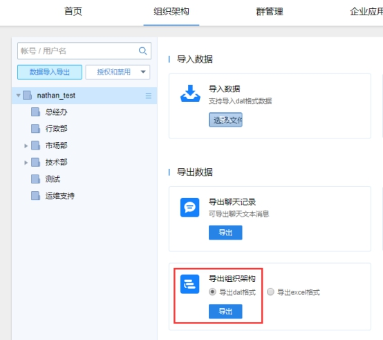
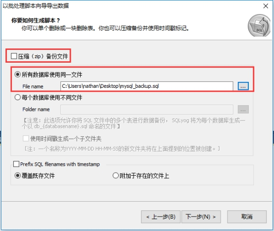

# 有度升级文档

## 注意事项

1. 服务端升级会导致有度暂时不可用，需提前发布公告。

2. 升级前需确认好服务端版本，可在有度管理后台底部显示确认。

3. 由于服务器已发布多个版本，不同版本的程序设计、数据库等存在一定的差异，若版本跨度过大直接升级很可能导致数据损坏、丢失或其他无法预知的故障。

4. 为保证数据的完整性和可用性，版本升级需遵循以下原则：

- 服务端版本小于V3.1时，如V2.5,则升级流程为V2.5--->V3.1--->3.3--->V2020.1
- 服务端版本大于或等于V3.1时，则升级流程为V3.1--->3.3--->V2020.1

   5.服务端版本升级不清理数据，前提是需要保证安装路径与之前的一致；

   6.由于有度服务端安装包从V4.0之后将不再提供32位服务端安装程序，若需要安装V4.0以上版本进行使用，建议更换64位服务器系统，若需迁移，可参考有度迁移文档。

## 升级过程

### Windows服务端升级

#### **1.** **导出组织架构**

登录管理后台：http://IP:7080/userportal/login.html

路径：组织架构-数据导入导出-导出组织架构-导出dat格式。

 

#### **2.** **导出企业应用**

路径：组织架构-数据导入导出-导出企业应用。

 

#### **3.** **停止有度服务**

打开系统服务，停止Youdu Service。

 

 

#### **4.** **备份配置文件、会话数据**

拷贝youdu\server的config、db目录。

>db文件夹包含一个files文件夹，里面是服务器存储的聊天记录中的文件、图片，不需要可以不备份。

**如果删除files文件夹，客户端将无法从服务器上下载历史文件。客户端本地已保存的文件不受影响。**

 

#### **5.** **备份mysql数据**

l 点击高级工具-计划备份。

 

l 点击下一步。

 

l 数据库选择全部，其他保持默认，继续下一步。

 

l 取消勾选“压缩（zip）备份文件，”选择sql文件的备份路径，名称自定义。

 

l 继续下一步，直到完成。

  

 

至此升级备份完成。

#### 6.升级有度服务端

1)上传有度服务端安装程序，版本流程参考注意事项

2）直接运行服务端安装程序，保证安装路径一致

3）覆盖安装完成，访问有度管理后台，查看通讯录、群管理、企业应用数据是否完成。

4）登录客户端，测试消息收发、文件收发和聊天记录确认，若一起正常，则升级完成。

### linux服务端升级

#### **1.** 备份config、db文件夹

l 查看有度服务的所在路径

ps -ef |grep youdu

 

l 停止youdu_service。

systemctl stop youdu_service

 

l 查看youdu_service运行状态,如果显示dead表示已经停止。

systemctl status youdu_service

 

l 在根目录创建一个文件夹作为备份文件夹。

mkdir backup

 

l 进入有度服务端所在的文件夹。

cd /youdu

 

l 拷贝config、db文件夹到当前目录。

cp -r config/ db/ /backup/

 

l 进入备份文件夹，查看数据是否拷贝成功。

cd /backup/

 

#### **2.** 备份mysql数据

l 输入以下命令导出sql。

mysqldump -uroot -proot > mysql.sql

>用户名、密码请以实际为准。

 

#### 3.服务端覆盖安装升级

1）上传安装包到有度服务器。

2）解压安装包

tar -xvf 压缩包名称.tar.gz  

 

3)进入安装脚本目录

cd 解压目录/bin/  

 

4）执行有度安装脚本

./linuxInstall 安装路径（不能选择安装包目录）

 

5）输入mysql用户名

 

6）输入mysql密码

 

7）输入mysql服务地址、端口

 

8）安装完成

 

9）覆盖安装完成，访问有度管理后台，查看通讯录、群管理、企业应用数据是否完成

http://服务器IP:7080/userportal

10）登录客户端，测试消息收发、文件收发和聊天记录确认，若一起正常，则升级完成