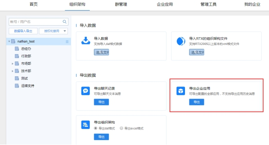
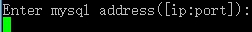

# 有度服务端升级指南

## 注意事项

- 服务端升级会导致有度暂时不可用，需提前发布公告。

- 升级前需确认好服务端版本，可在有度管理后台底部显示确认。

- 由于服务器已发布多个版本，不同版本的程序设计、数据库等存在一定的差异，若版本跨度过大直接升级很可能导致数据损坏、丢失或其他无法预知的故障。

  !>为保证数据的完整性和可用性，版本升级请务必遵循以下原则：  


- 服务端版本小于V3.1时，如V2.5,则升级流程为V2.5--->V3.1--->3.3--->V2020.1。**2.5以下版本升级，请联系我们协助。**
- 服务端版本大于或等于V3.1时，则升级流程为V3.1--->3.3--->V2020.1
- 服务端版本升级不清理数据，前提是需要保证安装路径与之前的一致；
- 由于有度服务端安装包从V4.0之后将不再提供32位服务端安装程序，若需要安装V4.0以上版本进行使用，建议更换64位服务器系统，若需迁移，可参考有度迁移文档。

## 升级前备份

### 导出组织架构

　　登录管理后台：http://server_IP:7080/userportal/login.html

　　路径：组织架构-数据导入导出-导出组织架构-导出dat格式。

 

###  导出企业应用

　　路径：组织架构-数据导入导出-导出企业应用。

 

### 关键数据备份

　　请参考[备份指南](admin/server_backup/server_backup.md)。

## Windows升级有度服务端

1. 上传有度服务端安装程序，版本流程参考注意事项

2. 直接运行服务端安装程序，保证安装路径一致


3. 覆盖安装完成，访问有度管理后台，查看通讯录、群管理、企业应用数据是否完成。

4. 登录客户端，测试消息收发、文件收发和聊天记录确认，若一起正常，则升级完成。

## linux服务端升级

1. 上传安装包到有度服务器。
2. 解压安装包

```
tar -xvf 压缩包名称.tar.gz
```

3. 进入安装脚本目录

```
cd 解压目录/bin/  
```

4. 执行有度安装脚本

./linuxInstall 安装路径

 !>请务必确认您的安装路径正确，也就是是您当前服务端的安装目录。

5. 输入mysql用户名

 

6. 输入mysql密码

 

8. 输入mysql服务地址、端口

 

!>以上mysql配置信息，请您确认正确。

9. 安装完成

 

10. 覆盖安装完成，访问有度管理后台，查看通讯录、群管理、企业应用数据是否完成

http://server_IP:7080/userportal

11. 登录客户端，测试消息收发、文件收发和聊天记录确认，若一切正常，则升级完成

## 升级完成后进行测试

　　以上步骤顺利执行完毕后，您的恢复已经完成。

　　对于服务端：请打开谷歌浏览器，登录有度后台 https://server-ip:7080/userportal 查看后台数据是否正常。

　　对于客户端：请进行登录、消息收发、组织架构、企业应用等功能的测试。

?>升级完成后如果有问题，经过自查后仍未解决，可以在工单系统或技术支持QQ联系我们[请求协助](./README)。