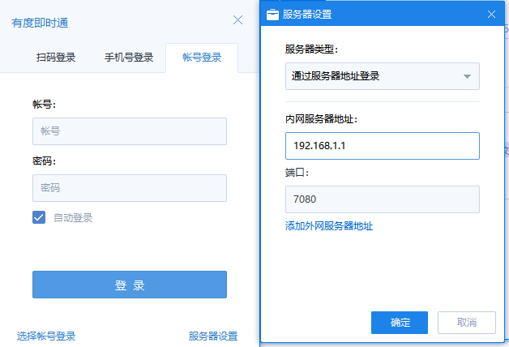
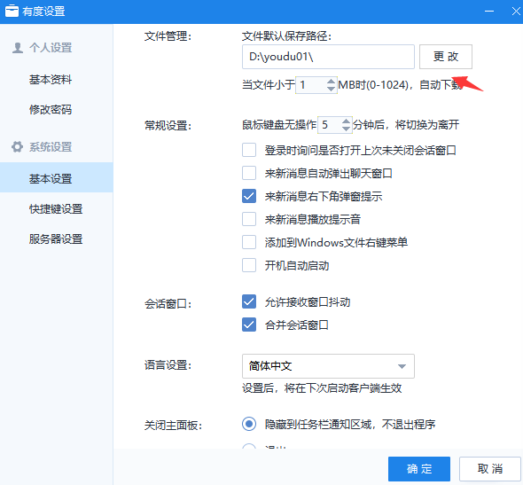

# 员工

##  谁是单位管理员

　　有度即时通是私有化部署系统，服务器在您单位内部管理。通常是您单位的IT部门同事负责，请您自行确认，比如联系人事行政部门了解。

?>我们建议您仔细查看此文档自助排查，如果依然解决不了问题，您可以直接和管理员反馈，或者提交[工单](https://kf.youdu.im)。

## 下载安装

### 如何下载安装有度即时通客户端

- 有度即时通客户端平台涉及Windows、Linux、iOS、Android，可根据单位管理员提供的有度管理后台下载链接进行客户端下载安装，也可以访问有度官网下载安装：https://youdu.im/download.html
- 移动端也可以直接打开应用商店，搜索“有度即时通”进行安装使用。

### 为什么有度客户端无法自定义安装路径

　　原因是考虑到有度客户端安装目录的权限问题，为了保证客户端能正常使用，所以有度客户端安装时不支持自定义安装路径。

## 登录

### 账号不存在

1. 确认服务器设置是否填写正确。

2. 确认账号填写是否有误。

以上信息均可联系单位管理员确认。

### 客户端登录提示账号或密码错误，或者忘记密码怎么办

　　如果多次尝试仍旧无法确认正确密码，则需要联系单位管理员确认准确账号信息，或者联系单位管理员进行密码修改，使用新密码登录有度客户端。

### 无法获取服务器地址

1. 确认服务器设置是否正确。

2. 检查客户端是否能正常访问服务器7080，7443，7006端口，常用命令PING、Telnet。

3. 若出现多客户端无法访问有度服务器，联系单位管理员确认有度服务端是否正常运行。

### 该总机号尚未开通服务

1. 确认填写的总机号是否正确。

2. 确认是否已联系技术支持做好总机号解析。

?>本地部署版有度服务端，如果需要通过总机号方式登录有度客户端，需要提前做好总机号解析。

### 提示手机号不存在

　　联系单位管理员确认账号是否以绑定手机号，如果没有，则需要提供手机号与账号绑定，方可使用手机号获取验证码登录

### 如何正确的登录有度即时通客户端

- 在登录有度客户端，请您咨询单位管理员，获取账号密码、服务器设置信息。

- 打开有度客户端，设置服务器信息。

  例如：

  1. 如果您是通过服务器地址登录，请填写单位管理员提供的IP地址或域名。
  2. 如果您是总机号登录，请填写您单位的总机号。
  3. 输入帐号，密码即可登录。

  !>此处只做示例，请您以您单位的实际设置为准，如果您不清楚，可以参考已经登录的同事设置，或者联系您单位管理员确认。

###  登录有度客户端有多少种方式

有度即时通客户端登录可根据电脑端和移动端区分。

- 电脑端登陆方式默认有三种，分别是扫码登录、手机号登录、账号密码登录。
- 移动端登录方式有两种，分别是手机号登录、账号密码登录。

无论是使用哪种登录方式登录有度客户端，需要保证服务器设置已经填写正确。

- 扫码登录方式：登录有度移动端APP，使用有度手机端扫描二维码，将当前移动端账号登录到电脑端。

- 手机号登录方式：填写手机号码，获取手机验证码后输入到电脑端，点击登录即可。

  > 注意：使用手机号登录的前提条件是，让单位管理员帮您将有度账号和手机号绑定，否则会提示手机号不存在。

- 账号密码方式：输入管理员提供的账号密码，点击登录即可。

## 功能使用

### 如何修改PC端文件保存路径

　　详细操作：

1. 打开有度设置，可点击主面板头像打开；

2. 选择基本设置，修改文件管理中的文件保存路径；

3. 选择更改，重新配置文件保存的目标路径即可。

### 客户端无法发送广播消息或短信

　　有度客户端发送广播消息或短信权限，需要有度管理员统一设置，客户端广播消息和短信按钮显示为灰色状态时，一般情况是有度管理员未给当前有度账号设置广播消息或发送短信权限，请联系单位管理员确认或配置使用权限即可。

## 异常情况

### Windows客户端无法打开任何会话,组织架构加载失败，手机端正常，只有自己出现。

您可以尝试重置网络，可以参考这个方法：

1. 点击开始菜单，点击运行，输入`cmd`
2. 执行命令`netsh winsock reset`
3. 如果上面报错，右键cmd，以管理员权限运行cmd，重新执行上述命令。
4. 重启电脑，再进程测试。

?>如果重启网络依然未能解决您的问题，请尝试[重置客户端本地数据](#如何重置客户端本地数据)。

### 客户端本地会话出错，如何重置客户端本地数据

- Windows客户端
  退出客户端，进入我的文档\youdu\个人文件夹（总机号+一串数字）\db目录，将session.db重命名（比如添加1），重新登录客户端。
- Mac客户端
  退出客户端，打开"/Users/电脑用户名/Library/Containers/im.xinda.youdu.mac/Data/Library/youdu/个人文件夹（总机号+一串数字）"，重命名或者删除session.db、msg.db，如果存在多个帐号，直接在youdu/下搜索session.db，msg.db，然后再重命名或者删除。

?>如果未能找到文件夹，可能被隐藏了，您可以自行打开。https://www.jianshu.com/p/14c31ae9c6c6

- 手机端直接卸载重装。
