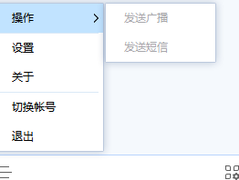

# 员工

## 说明

### 我们单位还没有开通有度，如何使用

 　　有度即时通是企业软件，您单位首先要开通服务端，您才可以登录使用。如果您单位尚未开通服务端，请联系单位管理员开通使用，管理员如有疑问可以联系我们。

　　官网：https://youdu.im

###  谁是单位管理员，如何联系

　　单位管理员（以下简称“管理员”）一般是您单位的IT部门人员，如果您找不到该岗位负责人，您可以尝试与您单位的人事行政部门了解确认。

### 使用问题如何得到解决

　　如果您在使用过程中遇到问题，我们建议您先通过此文档自助排查，如果仍无法解决，可以和管理员反馈，或者提交[工单](https://kf.youdu.im)反馈给我们。

### 员工使用流程

1. 下载客户端安装包并进行安装；
2. 联系管理员开通有度帐号，并确认服务器类型、信息；
3. 登录即可使用；

## 客户端下载与安装

### 官网下载地址

　　　https://youdu.im/download.html

### 支持平台

 　　　Windows，Mac，Linux，iOS，Android。

### 移动端扫码下载

**iOS：**

**Android：**

?>您也可以通过手机的应用商店，搜索“有度即时通”进行安装使用。

### 私有下载地址

　　部门单位已经开启专属的客户端下载地址，请您联系管理员获取详细信息。

### Windows安装

1. 双击打开安装包

2. 选择您的安装语言

3. 点击安装

4. 安装完成

>问：为什么有度客户端无法自定义安装路径？  
>
>答：原因是考虑到有度客户端安装目录的权限问题，为了保证客户端能正常使用，所以有度客户端安装时不支持自定义安装路径。

### Mac安装

1. 双击打开安装包

2. 拖动有度即时通到Applications

3. 打开启动台，即可看到有度应用

### 移动端安装

　　下载后根据手机系统指引安装即可。

## 设置服务器地址，开通帐号

　　请您联系管理员，获取服务器设置信息，并申请开通有度帐号。

> 问：总机号和服务器地址有什么区别？  
> 答：总机号是企业唯一ID标识，服务器地址是有度服务端的服务器地址。
>
> 问：我该选择总机号还是服务器地址？应该填写什么信息？  
> 答：请您联系管理员，获取正确的设置信息。有的单位是总机号，有的是服务器地址，有的两者均支持。不同的企业的设置不一样。

!>请注意，这个环节有任何疑问，请您联系管理员确认。

## 登录

### 账号不存在

1. 请确认帐号名称输入正确，例如空格、特殊字符等。
2. 请确认帐号已经开通，如果未开通请联系管理员开通。
3. 请确认服务器设置正确，可以看下已经登录的同事的设置信息，或者联系管理员确认。

### 密码错误，或者忘记密码怎么办

　　请联系管理员重置密码。

### 无法获取服务器地址

1. 请确认服务器设置正确，可以看下已经登录的同事的设置信息，或者联系管理员确认。
2. 请确认客户端是否能正常访问服务器7080，7443，7006端口，常用命令PING、Telnet，如有疑问请联系管理员；
3. 如果多个客户端出现此错误提示，请尽快联系管理员反馈此问题。[管理员请点击查看解决方法](admin/admin_faq/admin_faq?id=无法获取服务器地址)。

### 该总机号尚未开通服务

1. 请联系管理员，确认您单位支持总机号登录。
2. 请确认总机号输入正确。
3. 如果仍未解决，请联系管理员反馈。[管理员请点击查看解决方法](admin/admin_faq/admin_faq?id=如何开通总机号登录)

### 提示手机号不存在

　　联系单位管理员确认账号是否已绑定手机号，如果没有，则需要提供手机号与账号绑定，方可使用手机号获取验证码登录

### 如何正确的登录有度即时通客户端

- 在登录有度客户端，请您咨询单位管理员，获取账号密码、服务器设置信息。

- 打开有度客户端，设置服务器信息。

  例如：

  1. 如果您是通过服务器地址登录，请填写单位管理员提供的IP地址或域名。
  2. 如果您是总机号登录，请填写您单位的总机号。
  3. 输入帐号，密码即可登录。

  !>此处只做示例，请您以您单位的实际设置为准，如果您不清楚，可以参考已经登录的同事设置，或者联系您单位管理员确认。

###  登录有度客户端有多少种方式

有度即时通客户端登录可根据电脑端和移动端区分。

- 电脑端登陆方式默认有三种，分别是扫码登录、手机号登录、账号密码登录。
- 移动端登录方式有两种，分别是手机号登录、账号密码登录。

无论是使用哪种登录方式登录有度客户端，需要保证服务器设置已经填写正确。

- 扫码登录方式：登录有度移动端APP，使用有度手机端扫描二维码，将当前移动端账号登录到电脑端。

- 手机号登录方式：填写手机号码，获取手机验证码后输入到电脑端，点击登录即可。

  > 注意：使用手机号登录的前提条件是，让单位管理员帮您将有度账号和手机号绑定，否则会提示手机号不存在。

- 账号密码方式：输入管理员提供的账号密码，点击登录即可。

## 功能使用

### 如何修改PC端文件保存路径

　　详细操作：

1. 打开有度设置，可点击主面板头像打开；

2. 选择基本设置，修改文件管理中的文件保存路径；

3. 选择更改，重新配置文件保存的目标路径即可。

### 客户端无法发送广播消息或短信

　　有度客户端发送广播消息或短信权限，需要有度管理员统一设置，客户端广播消息和短信按钮显示为灰色状态时，一般情况是有度管理员未给当前有度账号设置广播消息或发送短信权限，请联系单位管理员确认或配置使用权限即可。

## 异常情况

### Windows客户端无法打开任何会话,组织架构加载失败，手机端正常，只有自己出现。

您可以尝试重置网络，可以参考这个方法：

1. 点击开始菜单，点击运行，输入`cmd`
2. 执行命令`netsh winsock reset`
3. 如果上面报错，右键cmd，以管理员权限运行cmd，重新执行上述命令。
4. 重启电脑，再进程测试。

?>如果重启网络依然未能解决您的问题，请尝试[重置客户端本地数据](#如何重置客户端本地数据)。

### 客户端本地会话出错，如何重置客户端本地数据

- Windows客户端
  退出客户端，进入我的文档\youdu\个人文件夹（总机号+一串数字）\db目录，将session.db重命名（比如添加1），重新登录客户端。
- Mac客户端
  退出客户端，打开"/Users/电脑用户名/Library/Containers/im.xinda.youdu.mac/Data/Library/youdu/个人文件夹（总机号+一串数字）"，重命名或者删除session.db、msg.db，如果存在多个帐号，直接在youdu/下搜索session.db，msg.db，然后再重命名或者删除。

?>如果未能找到文件夹，可能被隐藏了，您可以自行打开。https://www.jianshu.com/p/14c31ae9c6c6

- 手机端直接卸载重装。